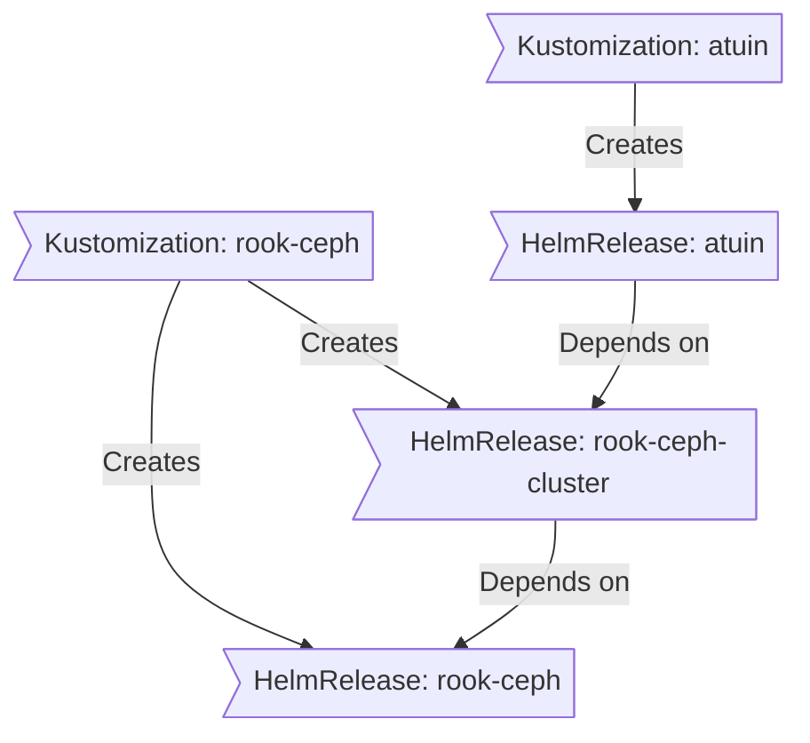

<div align="center">

### My Home Operations Repository :octocat:

_... managed with Flux, Renovate, and GitHub Actions_ 🤖

</div>

<div align="center">


[](https://github.com/kashalls/kromgo/)&nbsp;&nbsp;
[](https://github.com/kashalls/kromgo/)&nbsp;&nbsp;
[](https://github.com/kashalls/kromgo/)&nbsp;&nbsp;
[](https://github.com/kashalls/kromgo/)&nbsp;&nbsp;
[](https://github.com/kashalls/kromgo/)&nbsp;&nbsp;
[](https://github.com/kashalls/kromgo/)&nbsp;&nbsp;


</div>

---

## Overview

This is a monorepository is for my home kubernetes clusters.
I try to adhere to Infrastructure as Code (IaC) and GitOps practices using tools like [Kubernetes](https://kubernetes.io/), [Flux](https://github.com/fluxcd/flux2), [Renovate](https://github.com/renovatebot/renovate), and [GitHub Actions](https://github.com/features/actions).

The purpose here is to learn k8s, while practicing Gitops.

---

## ⛵ Kubernetes

There is a template over at [onedr0p/cluster-template](https://github.com/onedr0p/cluster-template) if you want to try and follow along with some of the practices I use here.

### Installation

My clusters run [talos linux](https://www.talos.dev) immutable kubernetes OS. This is a semi-hyper-converged cluster, workloads and block storage are sharing the same available resources on my nodes while I have a separate NAS server running TrueNAS with NFS/SMB shares, bulk file storage and backups.

#### Bootstrap Process

The cluster uses `just` as a task runner for bootstrapping and management. The bootstrap process is modular and consists of the following stages:

1. **Install Talos OS** - Apply Talos configuration to all nodes
2. **Bootstrap Kubernetes** - Initialize the Kubernetes control plane
3. **Fetch Kubeconfig** - Download cluster credentials
4. **Wait for Nodes** - Wait for nodes to be ready
5. **Apply Namespaces** - Create required Kubernetes namespaces
6. **Apply Resources** - Deploy bootstrap secrets and resources
7. **Apply CRDs** - Install Custom Resource Definitions
8. **Deploy Apps** - Install core applications via Helmfile

To bootstrap the cluster, run:

```bash
# Full bootstrap (all stages)
just bootstrap

# Or run individual stages
just bootstrap talos
just bootstrap k8s
just bootstrap kubeconfig
just bootstrap wait
just bootstrap namespaces
just bootstrap resources
just bootstrap crds
just bootstrap apps
```

**Prerequisites:**
- [mise](https://mise.jdx.dev/) - Tool version manager
- [1Password CLI](https://developer.1password.com/docs/cli/) - Secret injection
- Tools are automatically installed via mise: `mise install`

### Core Components

- [actions-runner-controller](https://github.com/actions/actions-runner-controller): self-hosted Github runners
- [cilium](https://github.com/cilium/cilium): internal Kubernetes networking plugin
- [cert-manager](https://cert-manager.io/docs/): creates SSL certificates for services in my cluster
- [cloudflared](https://github.com/cloudflare/cloudflared): enables Cloudflare secure access to my cluster services
- [envoy-gateway](https://github.com/envoyproxy/gateway): Kubernetes-native ingress controller using Envoy Proxy and Gateway API
- [external-dns](https://github.com/kubernetes-sigs/external-dns): automatically syncs DNS records from my cluster ingresses to a DNS provider
- [external-secrets](https://github.com/external-secrets/external-secrets/): managed Kubernetes secrets using [1Password](https://1password.com/)
- [rook-ceph](https://rook.io/): cloud native distributed block storage for Kubernetes
- [sops](https://toolkit.fluxcd.io/guides/mozilla-sops/): managed secrets for Kubernetes and Terraform which are committed to Git
- [spegel](https://github.com/XenitAB/spegel): stateless cluster local OCI registry mirror
- [volsync](https://github.com/backube/volsync): backup and recovery of persistent volume claims

### GitOps

[Flux](https://github.com/fluxcd/flux2) watches the clusters in my [kubernetes](./kubernetes/) folder (see Directories below) and makes the changes to my clusters based on the state of my Git repository.

The way Flux works for me here is it will recursively search the `kubernetes/${cluster}/apps` folder until it finds the most top level `kustomization.yaml` per directory and then apply all the resources listed in it. That aforementioned `kustomization.yaml` will generally only have a namespace resource and one or many Flux kustomizations. Those Flux kustomizations will generally have a `HelmRelease` or other resources related to the application underneath it which will be applied.

[Renovate](https://github.com/renovatebot/renovate) watches my **entire** repository looking for dependency updates, when they are found a PR is automatically created. When some PRs are merged Flux applies the changes to my cluster.

This Git repository contains the following directories under [Kubernetes](./kubernetes/).

```sh
📁 kubernetes
├── 📁 main            # main cluster
│   ├── 📁 apps           # applications
│   ├── 📁 bootstrap      # bootstrap procedures
│   ├── 📁 flux           # core flux configuration
│   └── 📁 templates      # re-useable components
└── 📁 ...             # other clusters
```

### Flux Workflow

This is a high-level look how Flux deploys my applications with dependencies. In most cases a `HelmRelease` will depend on other `HelmRelease`'s, in other cases a `Kustomization` will depend on other `Kustomization`'s, and in rare situations an app can depend on a `HelmRelease` and a `Kustomization`. The example below shows that `atuin` won't be deployed or upgrade until the `rook-ceph-cluster` Helm release is installed or in a healthy state.



## ☁️ Cloud Dependencies

While most of my infrastructure and workloads are self-hosted I do rely upon the cloud for certain key parts of my setup. This saves me from having to worry about three things. (1) Dealing with chicken/egg scenarios, (2) services I critically need whether my cluster is online or not and (3) The "hit by a bus factor" - what happens to critical apps (e.g. email, password manager, photos) that my family relies on when I no longer around.

Alternative solutions to the first two of these problems would be to host a Kubernetes cluster in the cloud and deploy applications like [HCVault](https://www.vaultproject.io/), [Vaultwarden](https://github.com/dani-garcia/vaultwarden), [ntfy](https://ntfy.sh/), and [Gatus](https://gatus.io/); however, maintaining another cluster and monitoring another group of workloads would be more work and probably be more or equal out to the same costs as described below.

| Service                                     | Use                                                               | Cost          |
| ------------------------------------------- | ----------------------------------------------------------------- | ------------- |
| [1Password](https://1password.com/)         | Secrets with [External Secrets](https://external-secrets.io/)     | ~$65/yr       |
| [Cloudflare](https://www.cloudflare.com/)   | Domain and S3                                                     | ~$30/yr       |
| [GitHub](https://github.com/)               | Hosting this repository and continuous integration/deployments    | Free          |
| [Pushover](https://pushover.net/)           | Kubernetes Alerts and application notifications                   | $5 OTP        |
| [Healthchecks.io](https://healthchecks.io/) | Monitoring internet connectivity and external facing applications | Free          |
|                                             |                                                                   | Total: ~$7/mo |

---
## 🤝 Thanks

Big shout out to original [cluster-template](https://github.com/onedr0p/cluster-template), and the [Home Operations](https://discord.gg/home-operations) Discord community.

Be sure to check out [kubesearch.dev](https://kubesearch.dev/) for ideas on how to deploy applications or get ideas on what you may deploy.

---

## 📜 Changelog

See my commit history [commit history](https://github.com/lukeevanstech/talos-cluster/commits/)
