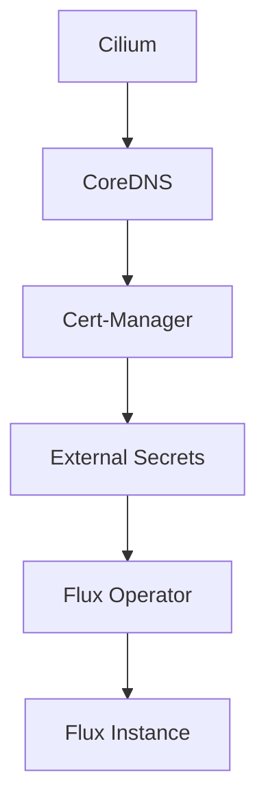

# Bootstrap Process

This document describes the bootstrap process for the Talos Kubernetes cluster using the `just` task runner.

## Overview

The bootstrap process uses a modular, stage-based approach powered by [just](https://github.com/casey/just), a modern command runner. This replaces the previous bash script-based bootstrap system with a more maintainable and debuggable solution.

## Architecture

### Task Runner Structure

```
.justfile                    # Root task runner with common utilities
└── bootstrap/mod.just       # Bootstrap-specific tasks
```

### Helmfile Structure

```
bootstrap/
├── resources.yaml.j2        # Bootstrap secrets and resources (Jinja2 template)
├── helmfile.yaml           # Legacy monolithic helmfile (deprecated)
└── helmfile.d/             # Modular helmfile structure
    ├── 00-crds.yaml        # CRD extraction from Helm charts
    ├── 01-apps.yaml        # Bootstrap applications
    └── templates/
        └── values.yaml.gotmpl  # DRY values template
```

## Prerequisites

### Required Tools

All tools are automatically installed via `mise`:

```bash
mise install
```

**Core Tools:**
- `just` - Task runner
- `kubectl` - Kubernetes CLI
- `helm` - Helm package manager
- `helmfile` - Declarative Helm deployment
- `talosctl` - Talos Linux CLI
- `kustomize` - Kubernetes configuration management
- `yq` - YAML processor
- `op` - 1Password CLI (for secret injection)

**Additional Tools:**
- `gum` - Beautiful shell logging
- `minijinja-cli` - Jinja2 template rendering

### Required Files

- `talos/clusterconfig/talosconfig` - Talos configuration
- `talos/clusterconfig/talos-cluster-*.yaml` - Per-node Talos configs
- `bootstrap/resources.yaml.j2` - Bootstrap resources template

### 1Password Authentication

The bootstrap process uses 1Password CLI for secret injection. Ensure you're authenticated:

```bash
op whoami
```

If not authenticated:

```bash
eval $(op signin)
```

## Bootstrap Stages

The bootstrap process consists of 8 sequential stages:

### Stage 1: Talos OS Installation

**Command:** `just bootstrap talos`

Applies Talos configuration to all nodes in the cluster.

**What it does:**
- Iterates through all nodes from `talosctl config`
- Applies Talos configuration to each node
- Skips nodes that are already configured
- Uses `--insecure` flag for initial bootstrap

**Example output:**
```
2025-11-04T15:00:00Z INFO Running stage... stage=talos
2025-11-04T15:00:05Z INFO Talos already configured, skipping apply of config stage=talos node=10.1.1.11
```

### Stage 2: Kubernetes Bootstrap

**Command:** `just bootstrap k8s`

Initializes the Kubernetes control plane.

**What it does:**
- Runs `talosctl bootstrap` on the first controller
- Retries every 5 seconds until successful
- Completes when etcd cluster is formed

**Example output:**
```
2025-11-04T15:01:00Z INFO Running stage... stage=k8s
2025-11-04T15:01:05Z INFO Kubernetes bootstrap in progress. Retrying in 5 seconds... stage=k8s
```

### Stage 3: Kubeconfig Retrieval

**Command:** `just bootstrap kubeconfig [lb]`

Downloads cluster credentials and configures kubectl.

**Parameters:**
- `lb` - Load balancer type (default: `cilium`)
  - `cilium` - Use Cilium LoadBalancer IP
  - `node` - Connect directly to control plane node

**What it does:**
- Fetches kubeconfig from Talos
- Sets context name to `talos-cluster`
- Optionally updates cluster server address

**Example output:**
```
2025-11-04T15:02:00Z INFO Running stage... stage=kubeconfig
```

### Stage 4: Node Readiness Wait

**Command:** `just bootstrap wait`

Waits for cluster nodes to be available.

**What it does:**
- Checks if nodes are already `Ready=True` (skip wait)
- Otherwise waits for nodes to transition to `Ready=False`
- Indicates nodes are booting and preparing for configuration

**Example output:**
```
2025-11-04T15:03:00Z INFO Running stage... stage=wait
2025-11-04T15:03:05Z INFO Nodes not available, waiting for nodes to be available. Retrying in 5 seconds... stage=wait
```

### Stage 5: Namespace Creation

**Command:** `just bootstrap namespaces`

Creates Kubernetes namespaces for all applications.

**What it does:**
- Scans `kubernetes/apps/*/` directories
- Extracts `Namespace` resources from each kustomization
- Applies namespaces server-side

**Example output:**
```
2025-11-04T15:04:00Z INFO Running stage... stage=namespaces
```

### Stage 6: Bootstrap Resources

**Command:** `just bootstrap resources`

Deploys critical bootstrap secrets and resources.

**What it does:**
- Renders `bootstrap/resources.yaml.j2` template
- Injects secrets from 1Password using `op inject`
- Applies resources server-side

**Resources deployed:**
- 1Password Connect credentials (external-secrets namespace)
- Cloudflare tunnel ID (network namespace)

**Example output:**
```
2025-11-04T15:05:00Z INFO Running stage... stage=resources
```

### Stage 7: CRD Installation

**Command:** `just bootstrap crds`

Installs Custom Resource Definitions from Helm charts.

**What it does:**
- Templates `helmfile.d/00-crds.yaml`
- Extracts CRDs using yq post-renderer
- Applies CRDs server-side

**Current CRDs:**
- Currently empty - add Helm charts here that ship CRDs

**Example output:**
```
2025-11-04T15:06:00Z INFO Running stage... stage=crds
```

### Stage 8: Application Deployment

**Command:** `just bootstrap apps`

Deploys bootstrap applications via Helmfile.

**What it does:**
- Syncs `helmfile.d/01-apps.yaml`
- Deploys applications in dependency order
- Waits for jobs and pods to be ready
- Executes post-sync hooks

**Applications deployed (in order):**
1. **Cilium** - Network CNI
   - Post-hook: Waits for CRDs
2. **CoreDNS** - DNS server
   - Depends on: Cilium
3. **Cert-Manager** - Certificate management
   - Depends on: CoreDNS
4. **External Secrets** - Secret management
   - Depends on: Cert-Manager
   - Post-hook: Waits for CRDs
5. **Flux Operator** - GitOps operator
   - Depends on: External Secrets
6. **Flux Instance** - GitOps controller
   - Depends on: Flux Operator

**Example output:**
```
2025-11-04T15:07:00Z INFO Running stage... stage=apps
```

## Usage

### Full Bootstrap

Run all stages in sequence:

```bash
just bootstrap
```

This is equivalent to:

```bash
just bootstrap talos
just bootstrap k8s
just bootstrap kubeconfig
just bootstrap wait
just bootstrap namespaces
just bootstrap resources
just bootstrap crds
just bootstrap apps
```

### Partial Bootstrap

Run individual stages as needed:

```bash
# Only deploy applications (assumes cluster is already bootstrapped)
just bootstrap apps

# Re-fetch kubeconfig
just bootstrap kubeconfig

# Re-apply namespaces
just bootstrap namespaces
```

### List Available Commands

```bash
just --list
```

## Dependency Management

Applications are deployed with explicit dependency chains using Helmfile's `needs` directive:



**Benefits:**
- Ensures correct deployment order
- Prevents race conditions
- Automatic retry on failures
- Clear dependency visualization

## Post-Sync Hooks

Certain applications use post-sync hooks to ensure dependent resources are ready:

### Cilium Hook

Waits for CRDs to be available:

```bash
until kubectl get crd \
  ciliumloadbalancerippools.cilium.io \
  ciliumbgpadvertisements.cilium.io \
  ciliumbgppeerconfigs.cilium.io \
  ciliumbgpclusterconfigs.cilium.io \
  &>/dev/null; do sleep 5; done
```

### External Secrets Hook

Waits for ClusterSecretStore CRD:

```bash
until kubectl get crd clustersecretstores.external-secrets.io \
  &>/dev/null; do sleep 5; done
```

## Values Template (DRY Principle)

The bootstrap uses a Go template to source Helm values from HelmRelease files:

**File:** `bootstrap/helmfile.d/templates/values.yaml.gotmpl`

```gotmpl
{{- $namespace := .Release.Namespace -}}
{{- $name := .Release.Name -}}
{{- $path := printf "../../../kubernetes/apps/%s/%s/app/helmrelease.yaml" $namespace $name -}}
{{ (fromYaml (readFile $path)).spec.values | toYaml }}
```

**How it works:**
1. Constructs path to HelmRelease file
2. Reads the YAML file
3. Extracts `.spec.values`
4. Returns as YAML

**Benefits:**
- Single source of truth for Helm values
- No duplication between HelmRelease and Helmfile
- Easier maintenance and updates

## Troubleshooting

### Check Bootstrap Status

```bash
# Check if Talos nodes are ready
talosctl get members

# Check Kubernetes nodes
kubectl get nodes

# Check bootstrap pods
kubectl get pods -n kube-system
kubectl get pods -n cert-manager
kubectl get pods -n external-secrets
kubectl get pods -n flux-system

# Check Flux sync status
flux get kustomizations
```

### Common Issues

#### 1. "Failed to fetch kubeconfig"

**Cause:** Control plane not ready

**Solution:**
```bash
# Wait for control plane
sleep 30
just bootstrap kubeconfig
```

#### 2. "Failed to apply namespace"

**Cause:** Cluster not accessible

**Solution:**
```bash
# Verify kubeconfig
kubectl cluster-info
export KUBECONFIG=$(pwd)/kubeconfig
```

#### 3. "Failed to sync helmfile"

**Cause:** Missing CRDs or dependency failures

**Solution:**
```bash
# Check Helm releases
helmfile -f bootstrap/helmfile.d/01-apps.yaml list

# View detailed errors
helmfile -f bootstrap/helmfile.d/01-apps.yaml sync --debug
```

#### 4. "op inject failed"

**Cause:** 1Password CLI not authenticated

**Solution:**
```bash
# Authenticate with 1Password
eval $(op signin)

# Verify authentication
op whoami
```

### Debug Mode

Run just with debug output:

```bash
just --verbose bootstrap
```

Run helmfile with debug output:

```bash
helmfile -f bootstrap/helmfile.d/01-apps.yaml sync --debug
```

## Advanced Usage

### Customizing the Bootstrap

#### Adding New CRDs

Edit `bootstrap/helmfile.d/00-crds.yaml`:

```yaml
releases:
  - name: my-operator
    namespace: operators
    chart: oci://registry.example.com/my-operator
    version: 1.0.0
```

#### Adding New Bootstrap Apps

Edit `bootstrap/helmfile.d/01-apps.yaml`:

```yaml
releases:
  - name: my-app
    namespace: my-namespace
    chart: oci://registry.example.com/my-app
    version: 1.0.0
    values:
      - ./templates/values.yaml.gotmpl
    needs:
      - flux-system/flux-instance  # Depends on Flux
```

#### Modifying Bootstrap Resources

Edit `bootstrap/resources.yaml.j2` to add secrets or resources:

```yaml
---
apiVersion: v1
kind: Secret
metadata:
  name: my-secret
  namespace: my-namespace
stringData:
  value: op://vault/item/field
```

## Migration from Bash Scripts

The old bash-based bootstrap system (`scripts/bootstrap-apps.sh`) has been removed. If you're migrating from the old system:

### Old Command

```bash
./scripts/bootstrap-apps.sh
```

### New Command

```bash
just bootstrap
```

### Key Differences

| Feature | Old (Bash) | New (Just) |
|---------|-----------|------------|
| **Modularity** | Monolithic script | Granular stages |
| **Dependencies** | Manual ordering | Helmfile `needs` |
| **Logging** | Basic echo | Beautiful gum output |
| **Debugging** | Hard to debug | Run individual stages |
| **Values** | Duplicated | DRY via templates |
| **Maintenance** | ~300 lines of bash | Clean task definitions |

## References

- [just documentation](https://github.com/casey/just)
- [Helmfile documentation](https://helmfile.readthedocs.io/)
- [Talos Linux documentation](https://www.talos.dev/)
- [1Password CLI documentation](https://developer.1password.com/docs/cli/)
- [onedr0p/home-ops bootstrap](https://github.com/onedr0p/home-ops/tree/main/bootstrap)

## Changelog

### 2025-11-04 - Bootstrap Modernization

- Migrated from bash scripts to just task runner
- Implemented modular helmfile structure
- Added DRY values templating
- Added explicit dependency management
- Improved logging with gum
- Removed 325 lines of bash code
- Added comprehensive documentation
