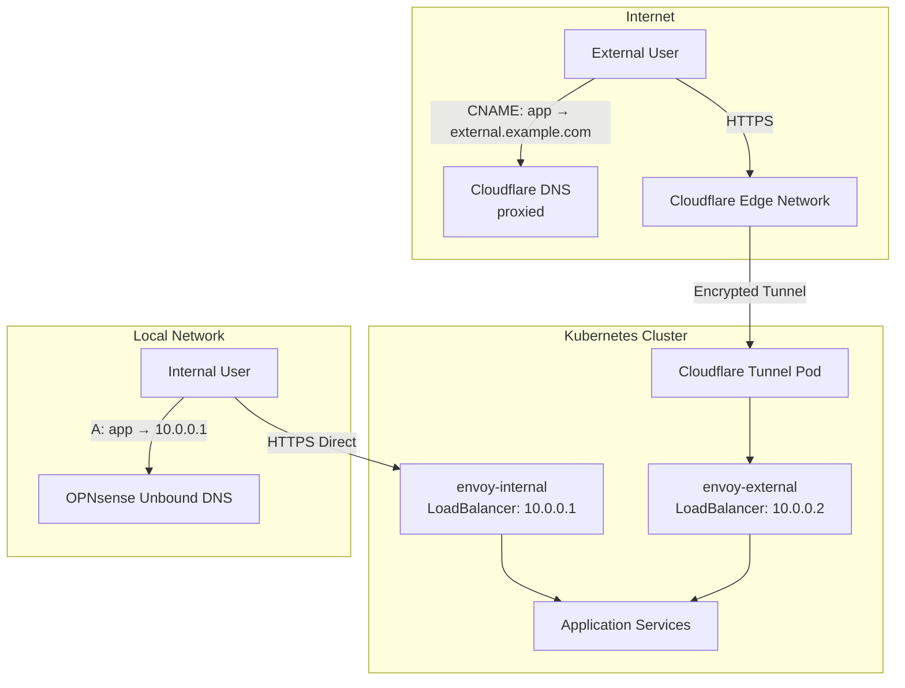
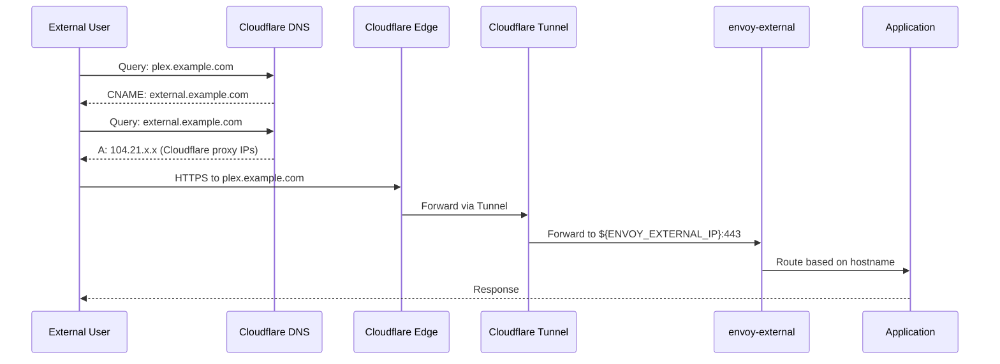
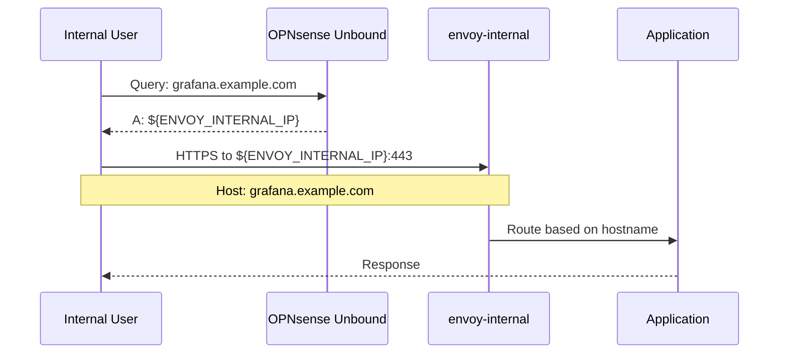
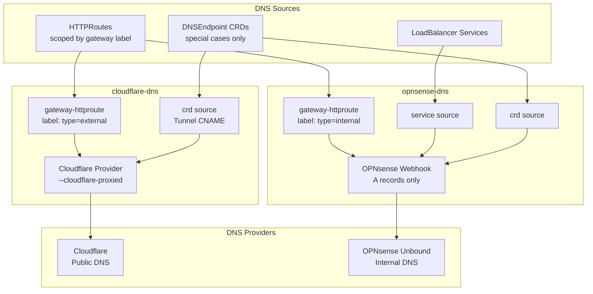
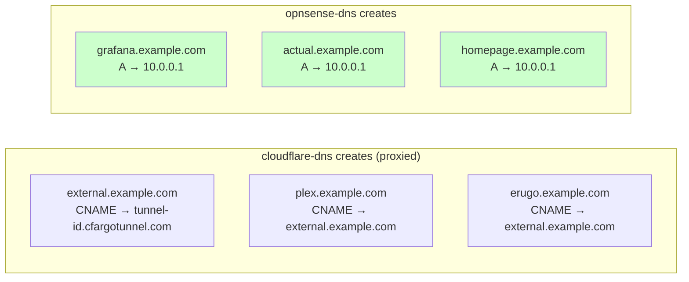
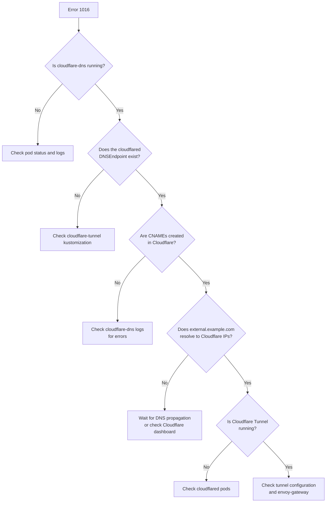

# Split DNS Architecture with Cloudflare and OPNsense

## Overview

This cluster uses a **split-horizon DNS architecture** with two `external-dns` instances:

1. **cloudflare-dns** — manages public DNS records in Cloudflare (external access through Cloudflare Tunnel, proxied).
2. **opnsense-dns** — manages internal DNS records in OPNsense Unbound (direct LAN access).

Which instance publishes a record is decided by the **gateway** an app's `HTTPRoute` attaches to:

- Routes on **`envoy-external`** (label `type=external`) → published by **cloudflare-dns**, publicly resolvable.
- Routes on **`envoy-internal`** (label `type=internal`) → published by **opnsense-dns**, resolvable only on the LAN (public queries return `NXDOMAIN` by design).

This means the same name can resolve differently depending on where the query comes from, and internal-only services are never exposed publicly.

!!! note "Records come from HTTPRoutes, not per-app CRDs"
    Both instances derive their records from `HTTPRoute` resources via external-dns's `gateway-httproute` source. There are **no** per-app `DNSEndpoint` CRDs. An earlier revision of this cluster required a `DNSEndpoint` for every app (~40 `dnsendpoint.yaml` files); that is no longer the case — see [How records are created](#how-records-are-created).

## Architecture Diagrams

### High-Level Architecture



> Example IPs only — the gateways' LoadBalancer addresses are static LAN IPs assigned literally in `envoy.yaml` (an allowlisted functional config); `${ENVOY_INTERNAL_IP}` in `cluster-secrets` supplies the internal gateway's external-dns target annotation.

### External DNS Flow (Internet Access)



### Internal DNS Flow (Local Network)



### DNS Controller Architecture



## DNS Controller Configurations

### cloudflare-dns (External)

**Location**: `kubernetes/apps/network/cloudflare-dns/`

**Configuration** (from `app/helmrelease.yaml`):

```yaml
provider: cloudflare
sources:
    - "crd" # only the Cloudflare Tunnel CNAME (labelled external-dns.io/cloudflare)
    - "gateway-httproute" # HTTPRoutes on the external gateway

extraArgs:
    - --cloudflare-dns-records-per-page=1000
    - --cloudflare-proxied
    - --crd-source-apiversion=externaldns.k8s.io/v1alpha1
    - --crd-source-kind=DNSEndpoint
    - --events
    - --gateway-label-filter=type=external # Only the external gateway

policy: sync
txtPrefix: k8s.%{record_type}-
txtOwnerId: default
domainFilters:
    - "${SECRET_DOMAIN}"
```

**What it manages**:

- `external.${SECRET_DOMAIN}` CNAME → `${CLOUDFLARE_TUNNEL_ID}.cfargotunnel.com` (from the one `DNSEndpoint` CRD, `cloudflare-tunnel`)
- `<app>.${SECRET_DOMAIN}` records for apps whose `HTTPRoute` attaches to `envoy-external` (from the `gateway-httproute` source), proxied through Cloudflare

**Key Design Decision**: `--cloudflare-proxied` is **enabled** — see [Why `--cloudflare-proxied` is enabled](#why-cloudflare-proxied-is-enabled).

### opnsense-dns (Internal)

**Location**: `kubernetes/apps/network/opnsense-dns/`

**Configuration** (from `app/helmrelease.yaml`):

```yaml
provider:
    name: webhook
    webhook:
        image:
            repository: ghcr.io/crutonjohn/external-dns-opnsense-webhook

sources:
    - crd
    - gateway-httproute # HTTPRoutes on the internal gateway
    - service # LoadBalancer services

extraArgs:
    - --events
    - --gateway-label-filter=type=internal # Only the internal gateway

policy: upsert-only # Never delete records
registry: noop # No ownership tracking
domainFilters:
    - ${SECRET_DOMAIN}
    - ${SECRET_INTERNAL_DOMAIN}
```

**What it manages**:

- `<app>.${SECRET_DOMAIN}` A records → `${ENVOY_INTERNAL_IP}` for apps whose `HTTPRoute` attaches to `envoy-internal` (the bulk of the cluster) — from the `gateway-httproute` source
- A records for LoadBalancer service IPs (the `service` source)
- The `crd` source is enabled for special cases but currently matches nothing (the only internal-target `DNSEndpoint`, `games/minecraft`, is commented out of its kustomization)

## How records are created

### Records come from HTTPRoutes, not per-app CRDs

!!! warning "This changed"
    An earlier revision of this cluster required a `DNSEndpoint` CRD per app (~40 `kubernetes/apps/*/app/dnsendpoint.yaml` files). That is **no longer true**. external-dns's `gateway-httproute` source now derives the records directly from each app's `HTTPRoute`.

How it works now (this mirrors onedr0p's UniFi pattern, adapted for the OPNsense webhook):

- An app declares an `HTTPRoute` (the app-template `route:` key) with `parentRefs` pointing at `envoy-internal` or `envoy-external`.
- external-dns reads the route via `gateway-httproute`; the `--gateway-label-filter` on each instance decides which gateway (and therefore which DNS provider) owns the record.
- **Internal routes** (`envoy-internal`): opnsense-dns creates an **A record** targeting the gateway's LAN IP — the gateway carries `external-dns.alpha.kubernetes.io/record-type: A` and `target: ${ENVOY_INTERNAL_IP}` annotations, and an A record is exactly what the OPNsense webhook accepts. No CNAME, no per-app CRD.
- **External routes** (`envoy-external`): the gateway instead carries `external-dns.alpha.kubernetes.io/target: external.${SECRET_DOMAIN}` — a hostname, not an IP — so cloudflare-dns creates a **CNAME** `<app>.${SECRET_DOMAIN}` → `external.${SECRET_DOMAIN}`, which the tunnel `DNSEndpoint` below points at Cloudflare's edge.

`DNSEndpoint` CRDs are now reserved for the handful of records an `HTTPRoute` cannot express:

| CRD | Purpose | State |
| --- | ------- | ----- |
| `network/cloudflare-tunnel/app/dnsendpoint.yaml` | `external.${SECRET_DOMAIN}` CNAME → `${CLOUDFLARE_TUNNEL_ID}.cfargotunnel.com` — the tunnel target every external CNAME ultimately points at | **active** |
| `games/minecraft/app/dnsendpoint.yaml` | A record for an L4 (non-HTTP) service exposed via mc-router | **template, commented out** — an RFC1918 A record can't be proxied through Cloudflare, so it needs a public IP/CNAME setup |

Example of a special-case `DNSEndpoint` (the Cloudflare Tunnel target):

```yaml
# kubernetes/apps/network/cloudflare-tunnel/app/dnsendpoint.yaml
apiVersion: externaldns.k8s.io/v1alpha1
kind: DNSEndpoint
metadata:
    name: cloudflared
    labels:
        external-dns.io/cloudflare: "true"
spec:
    endpoints:
        - dnsName: external.${SECRET_DOMAIN}
          recordType: CNAME
          targets:
              - ${CLOUDFLARE_TUNNEL_ID}.cfargotunnel.com
```

### Why `--cloudflare-proxied` is enabled

`--cloudflare-proxied` is enabled, and it is safe **because cloudflare-dns no longer ingests internal records**:

- It only watches the `type=external` gateway and the single tunnel-CNAME `DNSEndpoint`.
- None of those are RFC1918 A records, so Cloudflare is never asked to proxy a private IP.

Proxying external apps gives Cloudflare's CDN/WAF/DDoS protection in front of them, in addition to the encryption and access control provided by the Tunnel.

!!! info "Historical note — this used to be the opposite"
    When every app had a `DNSEndpoint` (including ~35 internal A records pointing at RFC1918 IPs), cloudflare-dns processed all of them. With `--cloudflare-proxied` **on**, Cloudflare rejected the proxied RFC1918 A records and the controller crashed before it could create the external CNAMEs — surfacing as **Cloudflare Error 1016**. The workaround at the time was to *remove* `--cloudflare-proxied`. Moving record creation to the gateway-scoped `gateway-httproute` source removed the internal records from cloudflare-dns entirely, so proxying could be turned back on.

## DNS Record Types by Controller



## Gateway Labels and Filters

### External Gateway (`envoy-external`)

```yaml
metadata:
    labels:
        type: external # Matched by cloudflare-dns --gateway-label-filter
    annotations:
        external-dns.alpha.kubernetes.io/target: external.${SECRET_DOMAIN}

spec:
    infrastructure:
        annotations:
            lbipam.cilium.io/ips: <static LAN IP> # literal in envoy.yaml (allowlisted)
```

HTTPRoutes attached to this gateway create **proxied CNAME records in Cloudflare**.

### Internal Gateway (`envoy-internal`)

```yaml
metadata:
    labels:
        type: internal # Matched by opnsense-dns --gateway-label-filter
    annotations:
        external-dns.alpha.kubernetes.io/record-type: A
        external-dns.alpha.kubernetes.io/target: ${ENVOY_INTERNAL_IP}

spec:
    infrastructure:
        annotations:
            lbipam.cilium.io/ips: <static LAN IP> # literal in envoy.yaml (allowlisted)
```

HTTPRoutes attached to this gateway create **A records in OPNsense Unbound**.

## Troubleshooting

### Error: "Target 10.0.0.X is not allowed for a proxied record"

With `--cloudflare-proxied` enabled, this error means a **private (RFC1918) A record has leaked into cloudflare-dns** — it should only ever manage the external gateway and the tunnel CNAME. Look for:

- a stray `DNSEndpoint` with an RFC1918 target that isn't scoped away from Cloudflare, or
- an app `HTTPRoute` mistakenly attached to `envoy-external` while targeting an internal IP.

This is the failure mode that historically caused Error 1016. The fix is to keep internal records on opnsense-dns — **not** to disable proxying.

### Sites returning "Cloudflare Error 1016: Origin DNS error"



**Diagnostic commands**:

1. Check cloudflare-dns is running:

    ```bash
    kubectl get pods -n network -l app.kubernetes.io/name=cloudflare-dns
    ```

2. Check the tunnel DNSEndpoint exists:

    ```bash
    kubectl get dnsendpoint cloudflared -n network -o yaml
    ```

3. Check cloudflare-dns logs for CNAME creation:

    ```bash
    kubectl logs -n network deployment/cloudflare-dns | grep -i "external\|CNAME"
    ```

4. Verify DNS resolution:

    ```bash
    dig plex.example.com CNAME
    dig external.example.com A
    ```

### Internal apps not resolving on local network

1. Verify opnsense-dns is running:

    ```bash
    kubectl get pods -n network -l app.kubernetes.io/name=opnsense-dns
    ```

2. Check the webhook is healthy:

    ```bash
    kubectl logs -n network deployment/opnsense-dns
    ```

3. Confirm the app's `HTTPRoute` targets `envoy-internal`, and that opnsense-dns logged the record:

    ```bash
    kubectl logs -n network deployment/opnsense-dns | grep <app>
    ```

4. Check OPNsense Unbound has the record:
    - Log into OPNsense
    - Services → Unbound DNS → Overrides → Host Overrides

### Cloudflare Tunnel not routing traffic

1. Check cloudflared pods:

    ```bash
    kubectl get pods -n network -l app.kubernetes.io/name=cloudflared
    kubectl logs -n network deployment/cloudflared
    ```

2. Verify tunnel config:

    ```bash
    kubectl get configmap cloudflared -n network -o yaml
    ```

3. Test internal connectivity:

    ```bash
    kubectl run -it --rm debug --image=curlimages/curl --restart=Never -- \
      curl -k https://envoy-network-envoy-external-XXXXX.network.svc.cluster.local
    ```

## Maintenance

### Adding a New Internal App

1. Add an `HTTPRoute` (app-template `route:`) with `parentRefs` pointing at `envoy-internal`:

    ```yaml
    route:
        app:
            hostnames:
                - "{{ .Release.Name }}.${SECRET_DOMAIN}"
            parentRefs:
                - name: envoy-internal
                  namespace: network
    ```

2. opnsense-dns picks the route up via the `gateway-httproute` source and creates `<app>.${SECRET_DOMAIN}` A → `${ENVOY_INTERNAL_IP}` in OPNsense Unbound (usually within a minute).

No `DNSEndpoint` is required.

### Adding a New External App

1. Add an `HTTPRoute` with `parentRefs` pointing at `envoy-external` (same shape as above, `name: envoy-external`).

2. cloudflare-dns creates the proxied record in Cloudflare (a CNAME to `external.${SECRET_DOMAIN}`), and the app becomes reachable publicly through the Tunnel.

No `DNSEndpoint` is required.

### Exposing a non-HTTP (L4) service

For a service without an `HTTPRoute` (e.g. a game server fronted by mc-router), add a `DNSEndpoint` CRD with an explicit A-record target, as in `games/minecraft/app/dnsendpoint.yaml`. Note that Cloudflare cannot proxy an RFC1918 target, so an L4 service that must be reachable publicly needs a public IP or a dedicated CNAME setup.

### Updating Cloudflare Tunnel ID

If you recreate the Cloudflare Tunnel:

1. Update the tunnel ID in `cluster-secrets`:

    ```yaml
    CLOUDFLARE_TUNNEL_ID: "<new-tunnel-id>"
    ```

2. The `external.${SECRET_DOMAIN}` `DNSEndpoint` automatically updates to point to:

    ```text
    <new-tunnel-id>.cfargotunnel.com
    ```

3. Wait 1-2 minutes for DNS propagation.

## OPNsense Host-Override Record Ceiling

`opnsense-dns` reads and writes every record through OPNsense's `searchHostOverride`
API endpoint, which has an operational ceiling this cluster has already hit once.

!!! warning "Symptom: new apps get no DNS record, existing apps are unaffected"
    Once the ceiling trips, `opnsense-dns` fails **every** reconcile with `failed
    to get records with code 500`, so **no new record can be published anywhere in
    the cluster** — but records already written to Unbound keep resolving
    normally. The failure therefore presents narrowly, as "only new apps are
    broken," rather than as an outage.

- **It is a row-count threshold, not a byte limit.** OPNsense chunks its API
  response and truncates once the payload exceeds 65,528 bytes. Verified
  experimentally against a live host-override table: `rowCount=420` returns
  113,794 bytes cleanly; `rowCount=425` truncates. The trip point sits at roughly
  421-424 rows — it drifts slightly because row size varies with hostname length,
  not because there is a fixed byte budget per record.
- **`opnsense-dns` never deletes records.** It runs `--policy=upsert-only
  --registry=noop`, so removing a hostname from Git stops new records from being
  created but never reclaims the old one. Reclaiming a stale record is a manual
  OPNsense operation (Services → Unbound DNS → Overrides → Host Overrides), not
  something a Git revert alone fixes.
- **`upsert-only`/`noop` is a deliberate choice, not a misconfiguration to "fix."**
  A TXT registry adds roughly one bookkeeping row per managed record
  (external-dns v0.21.0), which would push this domain filter to roughly 433 rows
  — back over the ~421 ceiling that already tripped once. `policy: sync` with
  `registry: noop` is worse: without ownership tracking, a sync policy would
  delete every hand-made OPNsense host override outside external-dns's view,
  including device records and unrelated third-party domains hosted on the same
  OPNsense instance.
- **`${SECRET_INTERNAL_DOMAIN}` still exists and is still needed.** It was never
  only an app-hostname alias — it still carries device records that have no
  `${SECRET_DOMAIN}` equivalent: IPMI probe targets, core switches, the
  Kubernetes API endpoint, VM management interfaces, the NAS S3 endpoint, and a
  handful of media-service aliases. Retiring the redundant *app* hostname aliases
  removed roughly half the record set without touching any of those.
- **Keep host-override rows well under ~420.** Each app now costs one record
  instead of two (see "Routing" in `AGENTS.md`), which is most of the headroom
  this migration bought back. Watch for the `failed to get records with code 500`
  signature in `opnsense-dns` logs as the early warning before the ceiling trips
  again.

## References

- [External DNS Documentation](https://kubernetes-sigs.github.io/external-dns/)
- [Cloudflare Tunnel Documentation](https://developers.cloudflare.com/cloudflare-one/connections/connect-apps/)
- [OPNsense External DNS Webhook](https://github.com/crutonjohn/external-dns-opnsense-webhook)
- [onedr0p home-ops (reference pattern)](https://github.com/onedr0p/home-ops)

---

**Last Updated**: 2026-06-16
**Cluster**: talos-cluster
