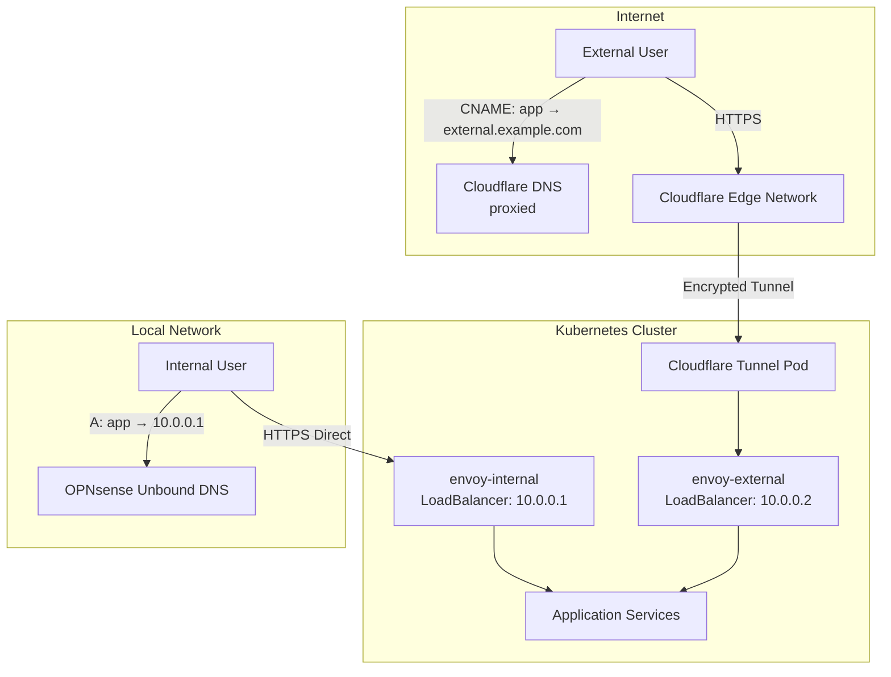
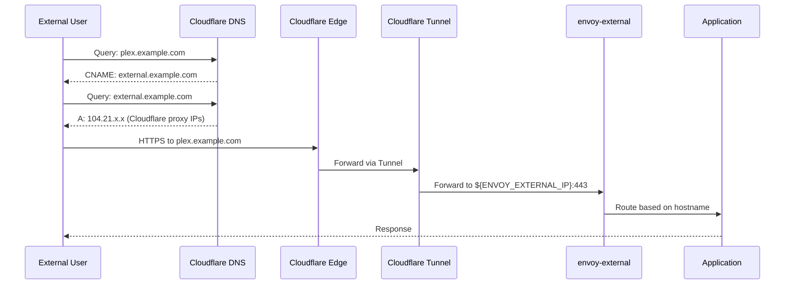
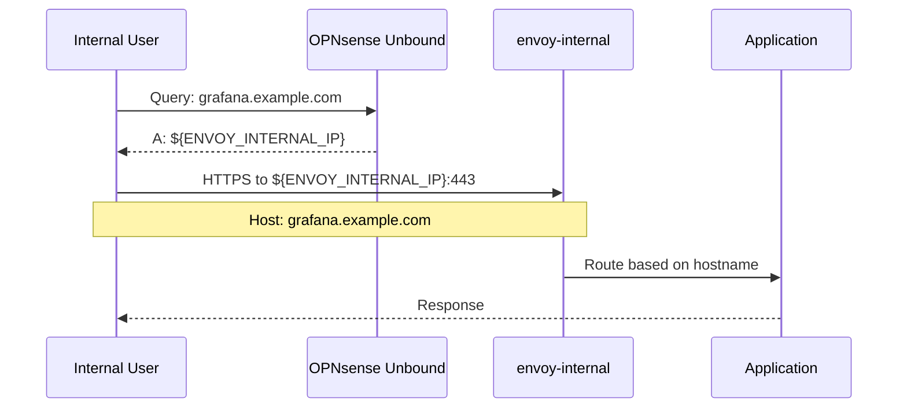
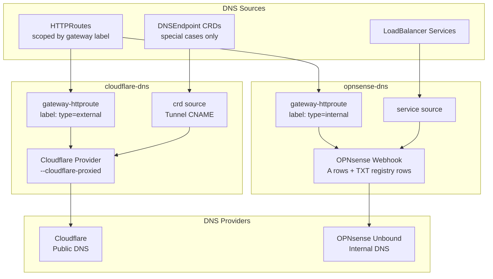
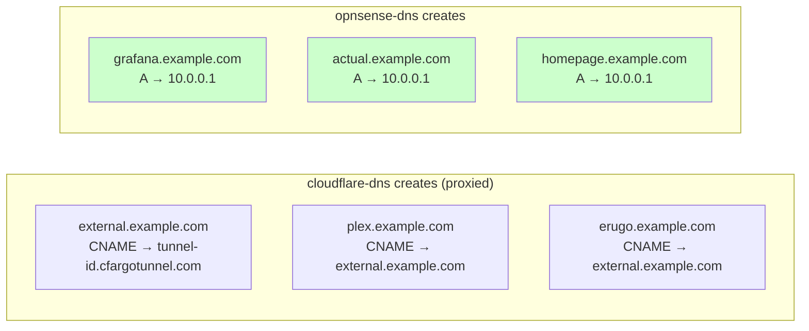
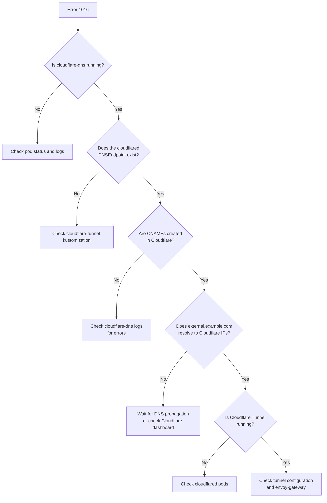

# Split DNS architecture with Cloudflare and OPNsense

## Overview

This cluster uses a **split-horizon DNS architecture** with two `external-dns` instances:

1. **cloudflare-dns**: manages public DNS records in Cloudflare (external access through Cloudflare Tunnel, proxied).
2. **opnsense-dns**: manages internal DNS records in OPNsense Unbound (direct LAN access).

Which instance publishes a record is decided by the **gateway** an app's `HTTPRoute` attaches to:

- Routes on **`envoy-external`** (label `type=external`) → published by **cloudflare-dns**, publicly resolvable.
- Routes on **`envoy-internal`** (label `type=internal`) → published by **opnsense-dns**, resolvable only on the LAN (public queries return `NXDOMAIN` by design).

This means the same name can resolve differently depending on where the query comes from, and internal-only services are never exposed publicly.

!!! note "Records come from HTTPRoutes, not per-app CRDs"
    Both instances derive their records from `HTTPRoute` resources via external-dns's `gateway-httproute` source. There are **no** per-app `DNSEndpoint` CRDs. An earlier revision of this cluster required a `DNSEndpoint` for every app (~40 `dnsendpoint.yaml` files); that is no longer the case. See [How records are created](#how-records-are-created).

## Architecture diagrams

### High-level architecture


```mermaid
graph TB
    subgraph Internet
        User[External User]
        CF[Cloudflare DNS<br/>proxied]
        CFEdge[Cloudflare Edge Network]
    end

    subgraph "Kubernetes Cluster"
        CFTunnel[Cloudflare Tunnel Pod]
        EnvoyExt[envoy-external<br/>LoadBalancer: 10.0.0.2]
        EnvoyInt[envoy-internal<br/>LoadBalancer: 10.0.0.1]
        Apps[Application Services]
    end

    subgraph "Local Network"
        LocalUser[Internal User]
        OPN[OPNsense Unbound DNS]
    end

    User -->|CNAME: app → external.example.com| CF
    User -->|HTTPS| CFEdge
    CFEdge -->|Encrypted Tunnel| CFTunnel
    CFTunnel --> EnvoyExt
    EnvoyExt --> Apps

    LocalUser -->|A: app → 10.0.0.1| OPN
    LocalUser -->|HTTPS Direct| EnvoyInt
    EnvoyInt --> Apps
```

> Example IPs only. The gateways' LoadBalancer addresses are static LAN IPs assigned literally in `envoy.yaml` (an allowlisted functional config); `${ENVOY_INTERNAL_IP}` in `cluster-secrets` supplies the internal gateway's external-dns target annotation.

### External DNS flow (internet access)


```mermaid
sequenceDiagram
    participant User as External User
    participant DNS as Cloudflare DNS
    participant CFEdge as Cloudflare Edge
    participant Tunnel as Cloudflare Tunnel
    participant Envoy as envoy-external
    participant App as Application

    User->>DNS: Query: plex.example.com
    DNS-->>User: CNAME: external.example.com
    User->>DNS: Query: external.example.com
    DNS-->>User: A: 104.21.x.x (Cloudflare proxy IPs)
    User->>CFEdge: HTTPS to plex.example.com
    CFEdge->>Tunnel: Forward via Tunnel
    Tunnel->>Envoy: Forward to ${ENVOY_EXTERNAL_IP}:443
    Envoy->>App: Route based on hostname
    App-->>User: Response
```

### Internal DNS flow (local network)


```mermaid
sequenceDiagram
    participant User as Internal User
    participant DNS as OPNsense Unbound
    participant Envoy as envoy-internal
    participant App as Application

    User->>DNS: Query: grafana.example.com
    DNS-->>User: A: ${ENVOY_INTERNAL_IP}
    User->>Envoy: HTTPS to ${ENVOY_INTERNAL_IP}:443
    Note over User,Envoy: Host: grafana.example.com
    Envoy->>App: Route based on hostname
    App-->>User: Response
```

### DNS controller architecture


```mermaid
graph TB
    subgraph "DNS Sources"
        HTTPRoute[HTTPRoutes<br/>scoped by gateway label]
        Service[LoadBalancer Services]
        CRD[DNSEndpoint CRDs<br/>special cases only]
    end

    subgraph "cloudflare-dns"
        CF_HTTPRoute[gateway-httproute<br/>label: type=external]
        CF_CRD[crd source<br/>Tunnel CNAME]
        CF_Provider[Cloudflare Provider<br/>--cloudflare-proxied]
    end

    subgraph "opnsense-dns"
        OPN_HTTPRoute[gateway-httproute<br/>label: type=internal]
        OPN_Service[service source]
        OPN_Provider[OPNsense Webhook<br/>A rows + TXT registry rows]
    end

    subgraph "DNS Providers"
        Cloudflare[Cloudflare<br/>Public DNS]
        OPNsense[OPNsense Unbound<br/>Internal DNS]
    end

    HTTPRoute --> CF_HTTPRoute --> CF_Provider --> Cloudflare
    CRD --> CF_CRD --> CF_Provider

    HTTPRoute --> OPN_HTTPRoute --> OPN_Provider --> OPNsense
    Service --> OPN_Service --> OPN_Provider
```

## DNS controller configurations

### cloudflare-dns (external)

**Location**: `kubernetes/apps/network/cloudflare-dns/`

**Configuration** (from `app/helmrelease.yaml`):

```yaml
provider: cloudflare
sources:
    - "crd" # only the Cloudflare Tunnel CNAME (labelled external-dns.io/cloudflare)
    - "gateway-httproute" # HTTPRoutes on the external gateway

extraArgs:
    - --cloudflare-dns-records-per-page=1000
    - --cloudflare-proxied
    - --crd-source-apiversion=externaldns.k8s.io/v1alpha1
    - --crd-source-kind=DNSEndpoint
    - --events
    - --gateway-label-filter=type=external # Only the external gateway

policy: sync
txtPrefix: k8s.%{record_type}-
txtOwnerId: default
domainFilters:
    - "${SECRET_DOMAIN}"
```

**What it manages**:

- `external.${SECRET_DOMAIN}` CNAME → `${CLOUDFLARE_TUNNEL_ID}.cfargotunnel.com` (from the one `DNSEndpoint` CRD, `cloudflare-tunnel`)
- `<app>.${SECRET_DOMAIN}` records for apps whose `HTTPRoute` attaches to `envoy-external` (from the `gateway-httproute` source), proxied through Cloudflare

**Key Design Decision**: `--cloudflare-proxied` is **enabled**. See [Why `--cloudflare-proxied` is enabled](#why-cloudflare-proxied-is-enabled).

### opnsense-dns (internal)

**Location**: `kubernetes/apps/network/opnsense-dns/`

**Configuration** (from `app/helmrelease.yaml`):

```yaml
provider:
    name: webhook
    webhook:
        image:
            repository: ghcr.io/lukeevanstech/external-dns-opnsense-webhook
            tag: 0.1.0 # digest-pinned in the HelmRelease
        env:
            - name: OPNSENSE_DOMAINS # required by this provider: the domains it may write under
              value: ${SECRET_DOMAIN},${SECRET_INTERNAL_DOMAIN}

# One apply can take OPNSENSE_APPLY_TIMEOUT + OPNSENSE_RECONFIGURE_TIMEOUT (165s);
# the controller's write timeout and the pod's grace period sit above that.
deploymentStrategy:
    type: Recreate
terminationGracePeriodSeconds: 180

policy: sync # a hostname removed from Git is removed from Unbound
registry: txt # ownership tracked in TXT rows in the same table
txtOwnerId: main
txtPrefix: k8s.main.%{record_type}-
annotationPrefix: external-dns.alpha.kubernetes.io/ # pinned; see the comment in the HelmRelease

sources:
    - gateway-httproute # HTTPRoutes on the internal gateway
    - service # LoadBalancer services

extraArgs:
    - --events
    - --gateway-label-filter=type=internal # Only the internal gateway
    - --webhook-provider-read-timeout=30s
    - --webhook-provider-write-timeout=180s

domainFilters:
    - ${SECRET_DOMAIN}
    - ${SECRET_INTERNAL_DOMAIN}
```

**What it manages**:

- `<app>.${SECRET_DOMAIN}` A rows → `${ENVOY_INTERNAL_IP}` for apps whose `HTTPRoute` attaches to `envoy-internal` (the bulk of the cluster), from the `gateway-httproute` source
- A rows for LoadBalancer service IPs (the `service` source)
- One TXT registry row beside each of those, named `k8s.main.<type>-<name>`, which is how it knows what it owns (see [OPNsense host overrides: ownership and deletion](#opnsense-host-overrides-ownership-and-deletion))

The `crd` source is **not** enabled on this instance (dropped in [#5159](https://github.com/LukeEvansTech/talos-cluster/pull/5159) with the provider swap), so an internal-target `DNSEndpoint` is ignored until it is added back.

## How records are created

### Records come from HTTPRoutes, not per-app CRDs

!!! warning "This changed"
    An earlier revision of this cluster required a `DNSEndpoint` CRD per app (~40 `kubernetes/apps/*/app/dnsendpoint.yaml` files). That is **no longer true**. external-dns's `gateway-httproute` source now derives the records directly from each app's `HTTPRoute`.

How it works now (this mirrors onedr0p's UniFi pattern, adapted for the OPNsense webhook):

- An app declares an `HTTPRoute` (the app-template `route:` key) with `parentRefs` pointing at `envoy-internal` or `envoy-external`.
- external-dns reads the route via `gateway-httproute`; the `--gateway-label-filter` on each instance decides which gateway (and therefore which DNS provider) owns the record.
- **Internal routes** (`envoy-internal`): opnsense-dns creates an A record targeting the gateway's LAN IP. The gateway carries `external-dns.alpha.kubernetes.io/record-type: A` and `target: ${ENVOY_INTERNAL_IP}` annotations, and an A record is exactly what the OPNsense webhook accepts. No CNAME, no per-app CRD.
- **External routes** (`envoy-external`): the gateway instead carries `external-dns.alpha.kubernetes.io/target: external.${SECRET_DOMAIN}` (a hostname, not an IP), so cloudflare-dns creates a CNAME `<app>.${SECRET_DOMAIN}` → `external.${SECRET_DOMAIN}`, which the tunnel `DNSEndpoint` below points at Cloudflare's edge.

`DNSEndpoint` CRDs are now reserved for the handful of records an `HTTPRoute` cannot express:

| CRD | Purpose | State |
| --- | ------- | ----- |
| `network/cloudflare-tunnel/app/dnsendpoint.yaml` | `external.${SECRET_DOMAIN}` CNAME → `${CLOUDFLARE_TUNNEL_ID}.cfargotunnel.com` (the tunnel target every external CNAME ultimately points at) | **active** |
| `games/minecraft/app/dnsendpoint.yaml` | A record for an L4 (non-HTTP) service exposed via mc-router | **template, commented out** (an RFC1918 A record can't be proxied through Cloudflare, so it needs a public IP/CNAME setup; opnsense-dns no longer runs the `crd` source either) |

Example of a special-case `DNSEndpoint` (the Cloudflare Tunnel target):

```yaml
# kubernetes/apps/network/cloudflare-tunnel/app/dnsendpoint.yaml
apiVersion: externaldns.k8s.io/v1alpha1
kind: DNSEndpoint
metadata:
    name: cloudflared
    labels:
        external-dns.io/cloudflare: "true"
spec:
    endpoints:
        - dnsName: external.${SECRET_DOMAIN}
          recordType: CNAME
          targets:
              - ${CLOUDFLARE_TUNNEL_ID}.cfargotunnel.com
```

### Why `--cloudflare-proxied` is enabled

`--cloudflare-proxied` is enabled, and it is safe because cloudflare-dns no longer ingests internal records:

- It only watches the `type=external` gateway and the single tunnel-CNAME `DNSEndpoint`.
- None of those are RFC1918 A records, so Cloudflare is never asked to proxy a private IP.

Proxying external apps gives Cloudflare's CDN/WAF/DDoS protection in front of them, in addition to the encryption and access control provided by the Tunnel.

!!! info "Historical note: this used to be the opposite"
    When every app had a `DNSEndpoint` (including ~35 internal A records pointing at RFC1918 IPs), cloudflare-dns processed all of them. With `--cloudflare-proxied` **on**, Cloudflare rejected the proxied RFC1918 A records and the controller crashed before it could create the external CNAMEs. The result was **Cloudflare Error 1016**. The workaround at the time was to *remove* `--cloudflare-proxied`. Moving record creation to the gateway-scoped `gateway-httproute` source removed the internal records from cloudflare-dns entirely, so proxying could be turned back on.

## DNS record types by controller


```mermaid
graph LR
    subgraph "cloudflare-dns creates (proxied)"
        CF1[external.example.com<br/>CNAME → tunnel-id.cfargotunnel.com]
        CF2[plex.example.com<br/>CNAME → external.example.com]
        CF3[erugo.example.com<br/>CNAME → external.example.com]
    end

    subgraph "opnsense-dns creates"
        OPN1[grafana.example.com<br/>A → 10.0.0.1]
        OPN2[actual.example.com<br/>A → 10.0.0.1]
        OPN3[homepage.example.com<br/>A → 10.0.0.1]
    end

    style OPN1 fill:#ccffcc
    style OPN2 fill:#ccffcc
    style OPN3 fill:#ccffcc
```

## Gateway labels and filters

### External gateway (`envoy-external`)

```yaml
metadata:
    labels:
        type: external # Matched by cloudflare-dns --gateway-label-filter
    annotations:
        external-dns.alpha.kubernetes.io/target: external.${SECRET_DOMAIN}

spec:
    infrastructure:
        annotations:
            lbipam.cilium.io/ips: <static LAN IP> # literal in envoy.yaml (allowlisted)
```

HTTPRoutes attached to this gateway create **proxied CNAME records in Cloudflare**.

### Internal gateway (`envoy-internal`)

```yaml
metadata:
    labels:
        type: internal # Matched by opnsense-dns --gateway-label-filter
    annotations:
        external-dns.alpha.kubernetes.io/record-type: A
        external-dns.alpha.kubernetes.io/target: ${ENVOY_INTERNAL_IP}

spec:
    infrastructure:
        annotations:
            lbipam.cilium.io/ips: <static LAN IP> # literal in envoy.yaml (allowlisted)
```

HTTPRoutes attached to this gateway create **A records in OPNsense Unbound**.

## Troubleshooting

### Error: "Target 10.0.0.X is not allowed for a proxied record"

With `--cloudflare-proxied` enabled, this error means a private (RFC1918) A record has leaked into cloudflare-dns; it should only ever manage the external gateway and the tunnel CNAME. Look for:

- a stray `DNSEndpoint` with an RFC1918 target that isn't scoped away from Cloudflare, or
- an app `HTTPRoute` mistakenly attached to `envoy-external` while targeting an internal IP.

This is the failure mode that historically caused Error 1016. The fix is to keep internal records on opnsense-dns, **not** to disable proxying.

### Sites returning "Cloudflare Error 1016: Origin DNS error"


```mermaid
graph TD
    A[Error 1016] --> B{Is cloudflare-dns running?}
    B -->|No| C[Check pod status and logs]
    B -->|Yes| D{Does the cloudflared<br/>DNSEndpoint exist?}
    D -->|No| E[Check cloudflare-tunnel kustomization]
    D -->|Yes| F{Are CNAMEs created<br/>in Cloudflare?}
    F -->|No| G[Check cloudflare-dns logs<br/>for errors]
    F -->|Yes| H{Does external.example.com<br/>resolve to Cloudflare IPs?}
    H -->|No| I[Wait for DNS propagation<br/>or check Cloudflare dashboard]
    H -->|Yes| J{Is Cloudflare Tunnel<br/>running?}
    J -->|No| K[Check cloudflared pods]
    J -->|Yes| L[Check tunnel configuration<br/>and envoy-gateway]
```

**Diagnostic commands**:

1. Check cloudflare-dns is running:

    ```bash
    kubectl get pods -n network -l app.kubernetes.io/name=cloudflare-dns
    ```

2. Check the tunnel DNSEndpoint exists:

    ```bash
    kubectl get dnsendpoint cloudflared -n network -o yaml
    ```

3. Check cloudflare-dns logs for CNAME creation:

    ```bash
    kubectl logs -n network deployment/cloudflare-dns | grep -i "external\|CNAME"
    ```

4. Verify DNS resolution:

    ```bash
    dig plex.example.com CNAME
    dig external.example.com A
    ```

### Internal apps not resolving on local network

1. Verify opnsense-dns is running:

    ```bash
    kubectl get pods -n network -l app.kubernetes.io/name=opnsense-dns
    ```

2. Check the webhook is healthy:

    ```bash
    kubectl logs -n network deployment/opnsense-dns -c webhook
    ```

3. Confirm the app's `HTTPRoute` targets `envoy-internal`, and that opnsense-dns logged the record:

    ```bash
    kubectl logs -n network deployment/opnsense-dns | grep <app>
    ```

4. Check OPNsense Unbound has the record:
    - Log into OPNsense
    - Services → Unbound DNS → Overrides → Host Overrides

5. If the row is already there but has no `k8s.main.a-<name>` TXT row beside it, it is a hand-made row that the controller will not touch: see [KB-033](../troubleshooting/kb/033-opnsense-record-exists-but-is-unowned.md).

### Cloudflare Tunnel not routing traffic

1. Check cloudflared pods:

    ```bash
    kubectl get pods -n network -l app.kubernetes.io/name=cloudflared
    kubectl logs -n network deployment/cloudflared
    ```

2. Verify tunnel config:

    ```bash
    kubectl get configmap cloudflared -n network -o yaml
    ```

3. Test internal connectivity:

    ```bash
    kubectl run -it --rm debug --image=curlimages/curl --restart=Never -- \
      curl -k https://envoy-network-envoy-external-XXXXX.network.svc.cluster.local
    ```

## Maintenance

### Adding a new internal app

1. Add an `HTTPRoute` (app-template `route:`) with `parentRefs` pointing at `envoy-internal`:

    ```yaml
    route:
        app:
            hostnames:
                - "{{ .Release.Name }}.${SECRET_DOMAIN}"
            parentRefs:
                - name: envoy-internal
                  namespace: network
    ```

2. opnsense-dns picks the route up via the `gateway-httproute` source and creates `<app>.${SECRET_DOMAIN}` A → `${ENVOY_INTERNAL_IP}` in OPNsense Unbound (usually within a minute).

No `DNSEndpoint` is required.

### Adding a new external app

1. Add an `HTTPRoute` with `parentRefs` pointing at `envoy-external` (same shape as above, `name: envoy-external`).

2. cloudflare-dns creates the proxied record in Cloudflare (a CNAME to `external.${SECRET_DOMAIN}`), and the app becomes reachable publicly through the Tunnel.

No `DNSEndpoint` is required.

### Exposing a non-HTTP (L4) service

For a service without an `HTTPRoute` (e.g. a game server fronted by mc-router), the `service` source covers the internal record: annotate the LoadBalancer `Service` with `external-dns.alpha.kubernetes.io/hostname: <name>.${SECRET_DOMAIN}` and opnsense-dns publishes an A row for the Service's address. The `DNSEndpoint` template in `games/minecraft/app/dnsendpoint.yaml` only works if the `crd` source is added back to opnsense-dns. Cloudflare cannot proxy an RFC1918 target, so an L4 service that must be reachable publicly needs a public IP or a dedicated CNAME setup.

### Updating Cloudflare Tunnel ID

If you recreate the Cloudflare Tunnel:

1. Update the tunnel ID in `cluster-secrets`:

    ```yaml
    CLOUDFLARE_TUNNEL_ID: "<new-tunnel-id>"
    ```

2. The `external.${SECRET_DOMAIN}` `DNSEndpoint` automatically updates to point to:

    ```text
    <new-tunnel-id>.cfargotunnel.com
    ```

3. Wait 1-2 minutes for DNS propagation.

## OPNsense host overrides: ownership and deletion

`opnsense-dns` runs
[`LukeEvansTech/external-dns-opnsense-webhook`](https://github.com/LukeEvansTech/external-dns-opnsense-webhook),
which reads the host-override table in pages and keeps ownership in external-dns's TXT registry
(`txtOwnerId: main`, `txtPrefix: k8s.main.%{record_type}-`). It runs `policy: sync`, so removing a
hostname from Git removes its A row and its registry row on the next reconcile.

- **Hand-made rows are safe.** A row without a registry TXT is unowned; external-dns never updates
  or deletes it, and a declared hostname that collides with one is skipped (silently at the default
  log level, with an owner-mismatch line at debug) until the hand-made row is removed by hand
  ([KB-033](../troubleshooting/kb/033-opnsense-record-exists-but-is-unowned.md)).
- **An app on the external gateway that LAN clients should reach directly attaches its route to
  both gateways.** opnsense-dns then publishes the name against the internal gateway with a
  registry row, exactly like an internal-only app, while cloudflare-dns keeps the public CNAME.
  This replaced the hand-made rows that used to point those names at the external gateway's
  address (plex, status, requests, wizarr, kromgo, erugo and contracthound, 2026-09-15).
- **A row with a hand-made alias is never deleted by the controller.** The delete is refused and
  `OPNsenseDeleteBlocked` fires; re-home or delete the alias first
  ([KB-034](../troubleshooting/kb/034-opnsense-delete-blocked-by-alias.md)).
- **There is no publishing ceiling any more.** The previous sidecar
  (`crutonjohn/external-dns-opnsense-webhook`, run with `policy: upsert-only` and `registry: noop`)
  fetched the whole table in one HTTP/1.1 response and tripped a 64 KiB corruption bug in OPNsense
  26.7.0 at about 421 rows. That is why the old regime ran without a registry and never deleted a
  row, and why an earlier version of this page told you to stay under ~420 rows. The new provider
  pages with `rowCount` and never depends on one response size. Aliases still cost a row each, so
  keep them purposeful.
- **Every write is checked against a re-read.** OPNsense can acknowledge an `addHostOverride`
  with a uuid and never save it: it lost 2 of 282 concurrent adds during the cutover. The provider
  therefore sends writes one at a time and, after each apply phase, re-reads the table. A row that
  is missing is logged with its name and uuid, counted in
  `externaldns_webhook_opnsense_lost_writes_total`, and fails that phase, so no A row is created
  over a missing registry TXT and the next reconcile retries it. `OPNsenseLostWrite` fires on it.
- **Registry rows.** Each managed name carries one extra TXT row named `k8s.main.<type>-<name>`.
  If a delete of the data row succeeds and the delete of its TXT row fails, that TXT row is left
  behind for good (external-dns never plans registry rows for deletion); it is harmless to DNS and
  the migration tooling lists such orphans for removal.
- **Migration.** At the cutover, the rows created under the old `upsert-only`/`noop` regime were
  deleted from a reviewed allowlist and recreated by the new controller with registry rows within
  one reconcile; device rows managed from `network-ops` were untouched.
- **No daily restart.** The old sidecar needed a scheduled rollout restart to recover from a failed
  Unbound reload. The new provider retries the reload itself and reports an outstanding one through
  `OPNsensePendingReconfigure`, so the `opnsense-dns-restarter` CronJob was removed with the policy
  change.
- **`${SECRET_INTERNAL_DOMAIN}` still exists and is still needed.** It was never
  only an app-hostname alias; it still carries device records that have no
  `${SECRET_DOMAIN}` equivalent: IPMI probe targets, core switches, the
  Kubernetes API endpoint, VM management interfaces, the NAS S3 endpoint, and a
  handful of media-service aliases. Those are managed from `network-ops`, carry
  no registry row, and are exactly the rows the ownership model protects.

### Alerts

`kubernetes/apps/network/opnsense-dns/app/prometheusrule.yaml` carries four rules. The two gauge
rules also fire on series absence, because a NotReady sidecar takes the whole pod out of the
ServiceMonitor scrape and a value-only rule would go quiet exactly when the firewall is unreachable:

- **`OPNsenseDNSStale`** (critical): external-dns has not completed a sync for 15 minutes, or is not
  being scraped.
- **`OPNsensePendingReconfigure`** (warning): host overrides were saved but Unbound has not been
  reconfigured to serve them for 10 minutes, or the sidecar is not being scraped.
- **`OPNsenseDeleteBlocked`** (warning): the provider refused to delete a host override because a
  hand-made alias hangs off it ([KB-034](../troubleshooting/kb/034-opnsense-delete-blocked-by-alias.md)).
- **`OPNsenseLostWrite`** (warning): the firewall acknowledged a host-override write that was
  missing when the provider read the table back. The reconcile retries it; the sidecar log names
  the row. More than one in a day means OPNsense is dropping saves for a new reason, so check the
  firewall's own log before anything else.

The two counter rules have no `absent()` branch (the gauge rules already cover a missing scrape);
a second branch catches a fresh pod's first increment, which `increase()` alone reads as zero.

## Unbound include files do not survive a rebuild

Not every internal DNS answer comes from a host override. A few need raw Unbound
directives, whole-zone redirects in particular, which a host override cannot
express because it matches one exact name. Those live as `.conf` files in
Unbound's local override directory on the firewall, dropped over SSH and managed
declaratively from `LukeEvansTech/network-ops`
(`ansible/vars/unbound-includes.yml`, applied with `mise run
opnsense-unbound-includes`).

!!! danger "They are not in `config.xml`, so a restore does not bring them back"
    The firewall's whole backup and restore path is `config.xml`. Everything
    configured through the GUI or the API, meaning host overrides, NAT rules,
    interfaces, syslog targets and IPsec, lives there and returns on restore.
    These include files do not. A fresh install that imports `config.xml`
    therefore comes up looking complete while silently missing every one of
    them.

That is exactly what happened. The firewall was rebuilt on new hardware on
2026-07-29 with a fresh install, ZFS-on-root and `config.xml` imported, and the three
managed includes were never restored, because nothing in the restore path
carries them. **Nothing noticed for 28 days.** It is the same class of loss as
the plugin set that the same migration silently dropped.

- **`imgur-proxy`.** The whole-zone redirect that points `imgur.com` and every
  subdomain at `${SVC_IMGUR_PROXY_ADDR}`, the in-cluster SNI relay in
  `downloads/imgur-proxy`. Losing it does not break DNS; it just makes the
  resolver answer from the public internet again, so clients quietly stop using
  the proxy.
- **`firefox-canary`.** Returns NXDOMAIN for the Mozilla canary domain, which
  is what stops Firefox auto-enabling DNS-over-HTTPS and bypassing the on-box
  resolver entirely. Losing it is a silent hole in the DNS lockdown.
- **`statistics`.** Unbound extended statistics.

### Routine upgrades are not the cause

Worth stating plainly, because the timing invites the wrong conclusion and did
once already. The override directory is owned by the `opnsense` package, and a
point upgrade rewrites the four files the package ships into it, which updates
the directory's mtime and makes it look as though the directory was emptied at
that moment. It was not. Verified directly: the 2026-08-28 upgrade from
26.7.1_1 to 26.7.3_8 left all three restored includes untouched, with their
original mtimes, still copied into the chroot. `pkg` removes only files it owns.

So the trigger to watch for is a **rebuild or a restore**, not an upgrade.

### Why it presents as "nothing is wrong"

Every signal an operator would normally check stays green. Unbound keeps running
and keeps serving its host-override table correctly, so a spot check against the
resolver looks healthy. On the Kubernetes side the affected app is untouched:
`imgur-proxy` stayed `2/2 Running` with zero restarts, its HelmRelease Ready, its
LoadBalancer IP assigned and reachable, and its VPN tunnel up. It simply received
no traffic at all. The only direct evidence was its own access log. Every
connection in it came from the kubelet probe, and not one carried a real SNI.

The general lesson: **an app that depends on out-of-band DNS to be reached cannot
be diagnosed from its own health.** Read its access log, and prove the service
independently by forcing a client at it
(`curl --resolve <host>:443:<service IP>`) before touching anything.

### Detection

`observability/gatus` carries a `split-dns` endpoint group that asserts these
answers directly: the redirect resolves to the proxy address, and the canary
domain returns NXDOMAIN. Both fail the moment the includes go missing, and
`GatusEndpointDown` pages after five minutes. A third endpoint drives a real
request through the proxy, covering the half the DNS checks cannot see: the
relay's probes are `tcpSocket` only, so a dead VPN tunnel leaves the pod Ready
and serving nothing.

The addresses those checks compare against reach gatus as environment variables
from a `cluster-secrets` ExternalSecret, not through Flux substitution. The
gatus ConfigMap is generated with
`kustomize.toolkit.fluxcd.io/substitute: disabled` so that gatus's own `${VAR}`
expansion survives, which conveniently also keeps real addresses out of this
public repository.

### After a rebuild or a config restore

Re-apply the includes. The playbook is idempotent, so running it when nothing is
missing is a no-op:

```bash
mise run opnsense-unbound-includes-check   # confirm what is missing
mise run opnsense-unbound-includes         # restore and restart Unbound
```

Then confirm the answers, rather than trusting the run:

```bash
dig +short imgur.com A @<resolver>              # expect the proxy address
dig use-application-dns.net @<resolver>         # expect NXDOMAIN
```

An audit of the firewall on 2026-08-29 confirmed these three files are the
**only** hand-managed configuration outside `config.xml`. Every other
non-package file in the config trees is either generated by OPNsense's configd
templates from `config.xml`, or written by the system itself (Suricata's rules
database, the IPsec CA exports, the pkg repository definitions). Nothing else
needs re-applying after a rebuild.

## References

- [External DNS Documentation](https://kubernetes-sigs.github.io/external-dns/)
- [Cloudflare Tunnel Documentation](https://developers.cloudflare.com/cloudflare-one/connections/connect-apps/)
- [external-dns-opnsense-webhook (this cluster's OPNsense provider)](https://github.com/LukeEvansTech/external-dns-opnsense-webhook)
- [onedr0p home-ops (reference pattern)](https://github.com/onedr0p/home-ops)

---

**Last Updated**: 2026-09-15
**Cluster**: talos-cluster
