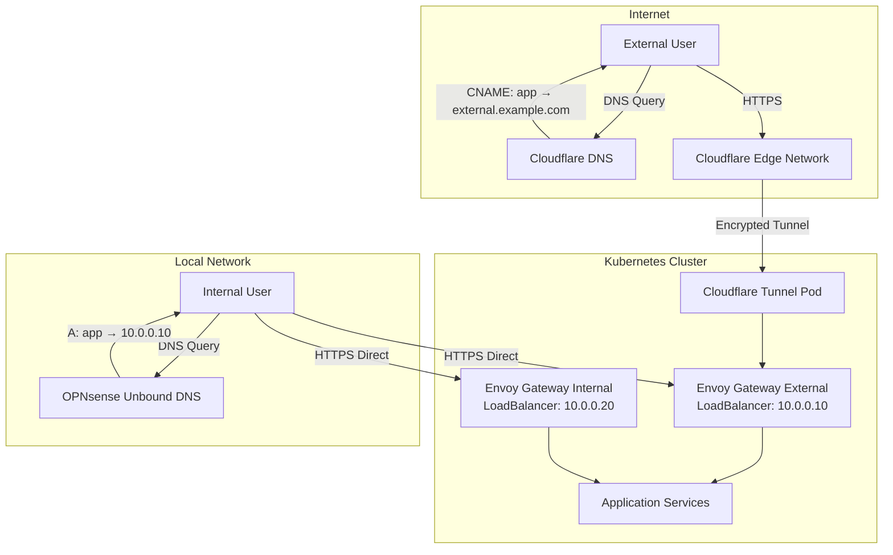
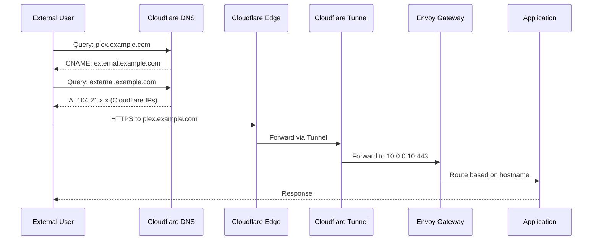
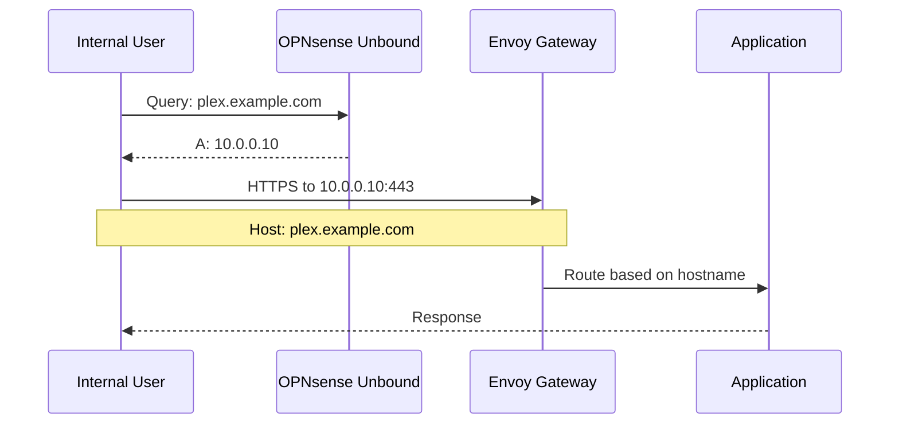
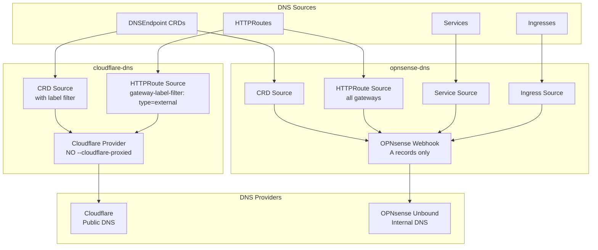
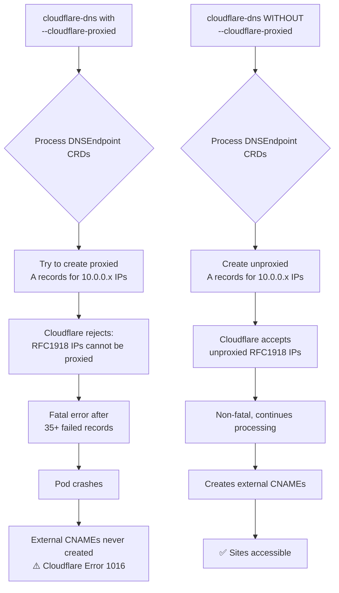
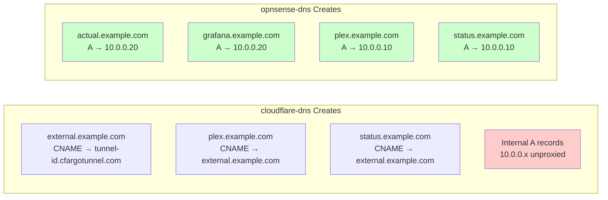
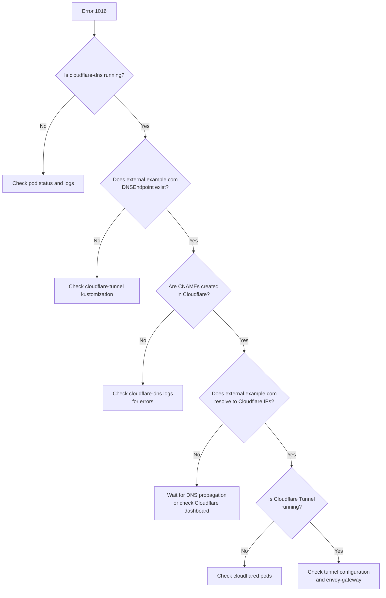

# Split DNS Architecture with Cloudflare and OPNsense

## Overview

This cluster uses a **split DNS architecture** with two external-dns instances:
1. **cloudflare-dns**: Manages external/public DNS records in Cloudflare
2. **opnsense-dns**: Manages internal DNS records in OPNsense Unbound

This setup enables:
- External access via Cloudflare Tunnel (*.example.com from internet)
- Internal access via direct IPs (*.example.com from local network)
- Same domain names resolve differently based on network location

## Architecture Diagrams

### High-Level Architecture



### External DNS Flow (Internet Access)



### Internal DNS Flow (Local Network)



### DNS Controller Architecture



## DNS Controller Configurations

### cloudflare-dns (External)

**Location**: `kubernetes/apps/network/cloudflare-dns/`

**Configuration**:
```yaml
sources:
  - "crd"              # DNSEndpoint resources (external.example.com only)
  - "gateway-httproute" # HTTPRoutes on external gateway

extraArgs:
  - --cloudflare-dns-records-per-page=1000
  - --crd-source-apiversion=externaldns.k8s.io/v1alpha1
  - --crd-source-kind=DNSEndpoint
  - --events
  - --gateway-label-filter=type=external  # Only external gateway

policy: sync
```

**What it manages**:
- `external.example.com` CNAME → Cloudflare Tunnel hostname (from DNSEndpoint CRD)
- `*.example.com` CNAMEs → external.example.com (from HTTPRoutes on envoy-external gateway)

**Key Design Decision**: `--cloudflare-proxied` is **intentionally removed**

### opnsense-dns (Internal)

**Location**: `kubernetes/apps/network/opnsense-dns/`

**Configuration**:
```yaml
sources:
  - "crd"              # DNSEndpoint resources (all internal A records)
  - "ingress"          # Legacy nginx ingresses
  - "gateway-httproute" # HTTPRoutes on internal gateway
  - "service"          # LoadBalancer services

extraArgs:
  - --crd-source-apiversion=externaldns.k8s.io/v1alpha1
  - --crd-source-kind=DNSEndpoint
  - --events
  - --ignore-ingress-tls-spec

policy: upsert-only  # Never delete records
registry: noop       # No ownership tracking
```

**What it manages**:
- `*.example.com` A records → Internal LoadBalancer IPs (from DNSEndpoint CRDs)
- LoadBalancer service IPs for internal/external gateways
- HTTPRoutes on envoy-internal gateway

## Critical Differences from onedr0p's Pattern

### Why We Have DNSEndpoint CRDs for Every App

**onedr0p's setup (UniFi DNS)**:
- No DNSEndpoint CRDs for individual apps
- HTTPRoutes automatically create both A and CNAME records
- UniFi webhook supports all record types

**Our setup (OPNsense DNS)**:
- **DNSEndpoint CRDs required** for EVERY app (~40 files in `kubernetes/apps/*/app/dnsendpoint.yaml`)
- OPNsense webhook **only supports A records**
- HTTPRoutes alone would create CNAMEs, which OPNsense webhook rejects
- Solution: DNSEndpoint CRDs create A records pointing to appropriate gateway IPs

Example DNSEndpoint for **internal app** (envoy-internal gateway):
```yaml
# kubernetes/apps/default/actual/app/dnsendpoint.yaml
apiVersion: externaldns.k8s.io/v1alpha1
kind: DNSEndpoint
metadata:
  name: actual
spec:
  endpoints:
    - dnsName: actual.${SECRET_DOMAIN}
      recordTTL: 300
      recordType: A
      targets:
        - ${ENVOY_INTERNAL_IP}  # e.g., 10.0.0.20
```

Example DNSEndpoint for **external app** (envoy-external gateway):
```yaml
# kubernetes/apps/media/plex/app/dnsendpoint.yaml
apiVersion: externaldns.k8s.io/v1alpha1
kind: DNSEndpoint
metadata:
  name: plex
spec:
  endpoints:
    - dnsName: plex.${SECRET_DOMAIN}
      recordTTL: 300
      recordType: A
      targets:
        - ${ENVOY_EXTERNAL_IP}  # e.g., 10.0.0.10
```

### Why --cloudflare-proxied is Removed



**Problem**: With `--cloudflare-proxied` enabled, cloudflare-dns would:
1. Process all DNSEndpoint CRDs (internal + external)
2. Try to create **proxied A records** for internal IPs (10.0.0.x)
3. Cloudflare **rejects proxied RFC1918 IPs** → errors
4. With 35+ failing A records, cloudflare-dns would **crash fatally**
5. External CNAME records (plex, status) never got created → Error 1016

**Solution**: Remove `--cloudflare-proxied`:
- Cloudflare accepts **unproxied A records** for internal IPs
- These records are harmless (never used, OPNsense provides the real internal DNS)
- cloudflare-dns **continues processing** and creates the critical CNAMEs
- HTTPRoute CNAMEs work correctly (plex.example.com → external.example.com)

**Trade-off**: External records are **not proxied** through Cloudflare CDN, but traffic still goes through Cloudflare Tunnel, so we get:
- ✅ DDoS protection (Tunnel)
- ✅ Access control (Tunnel)
- ✅ Encryption (Tunnel)
- ❌ CDN caching (not critical for most homelab use cases)

## DNS Record Types by Controller



## Gateway Labels and Filters

### External Gateway (`envoy-external`)

```yaml
metadata:
  labels:
    type: external  # Matched by cloudflare-dns --gateway-label-filter

spec:
  infrastructure:
    annotations:
      lbipam.cilium.io/ips: 10.0.0.10  # Example IP
```

HTTPRoutes attached to this gateway create **CNAME** records in Cloudflare.

### Internal Gateway (`envoy-internal`)

```yaml
metadata:
  labels:
    type: internal  # NOT matched by cloudflare-dns

spec:
  infrastructure:
    annotations:
      lbipam.cilium.io/ips: 10.0.0.20  # Example IP
```

HTTPRoutes attached to this gateway use **DNSEndpoint A records** for internal DNS.

## Troubleshooting

### Error: "Target 10.0.0.X is not allowed for a proxied record"

This error is **expected and harmless** with our configuration. It indicates:
- cloudflare-dns is processing internal DNSEndpoint CRDs
- Cloudflare is accepting them as unproxied A records
- The pod continues processing and creates the critical CNAMEs

**Do NOT re-enable `--cloudflare-proxied`** - it causes fatal crashes.

### Sites returning "Cloudflare Error 1016: Origin DNS error"



**Diagnostic commands**:

1. Check cloudflare-dns is running:
   ```bash
   kubectl get pods -n network -l app.kubernetes.io/name=cloudflare-dns
   ```

2. Check DNSEndpoint exists:
   ```bash
   kubectl get dnsendpoint cloudflared -n network -o yaml
   ```

3. Check cloudflare-dns logs for CNAME creation:
   ```bash
   kubectl logs -n network deployment/cloudflare-dns | grep -i "external\|CNAME"
   ```

4. Verify DNS resolution:
   ```bash
   dig status.example.com CNAME
   dig external.example.com A
   ```

### Internal apps not resolving on local network

Check opnsense-dns:

1. Verify opnsense-dns is running:
   ```bash
   kubectl get pods -n network -l app.kubernetes.io/name=opnsense-dns
   ```

2. Check webhook is healthy:
   ```bash
   kubectl logs -n network deployment/opnsense-dns
   ```

3. Verify DNSEndpoint exists for the app:
   ```bash
   kubectl get dnsendpoint -n <namespace>
   ```

4. Check OPNsense Unbound has the record:
   - Log into OPNsense
   - Services → Unbound DNS → Overrides → Host Overrides

### Cloudflare Tunnel not routing traffic

1. Check cloudflared pods:
   ```bash
   kubectl get pods -n network -l app.kubernetes.io/name=cloudflared
   kubectl logs -n network deployment/cloudflared
   ```

2. Verify tunnel config:
   ```bash
   kubectl get configmap cloudflared -n network -o yaml
   ```

3. Test internal connectivity:
   ```bash
   kubectl run -it --rm debug --image=curlimages/curl --restart=Never -- \
     curl -k https://envoy-network-envoy-external-XXXXX.network.svc.cluster.local
   ```

## Maintenance

### Adding a New Internal App

1. Create DNSEndpoint in `kubernetes/apps/<namespace>/<app>/app/dnsendpoint.yaml`:
   ```yaml
   apiVersion: externaldns.k8s.io/v1alpha1
   kind: DNSEndpoint
   metadata:
     name: <app>
   spec:
     endpoints:
       - dnsName: <app>.${SECRET_DOMAIN}
         recordTTL: 300
         recordType: A
         targets:
           - ${ENVOY_INTERNAL_IP}
   ```

2. Add to kustomization.yaml:
   ```yaml
   resources:
     - ./dnsendpoint.yaml
   ```

3. opnsense-dns will automatically create the A record in OPNsense Unbound

### Adding a New External App

1. Create DNSEndpoint in `kubernetes/apps/<namespace>/<app>/app/dnsendpoint.yaml`:
   ```yaml
   apiVersion: externaldns.k8s.io/v1alpha1
   kind: DNSEndpoint
   metadata:
     name: <app>
   spec:
     endpoints:
       - dnsName: <app>.${SECRET_DOMAIN}
         recordTTL: 300
         recordType: A
         targets:
           - ${ENVOY_EXTERNAL_IP}
   ```

2. Create HTTPRoute with `parentRefs` pointing to `envoy-external` gateway

3. Add DNSEndpoint to kustomization.yaml:
   ```yaml
   resources:
     - ./dnsendpoint.yaml
   ```

4. Both controllers will process the resources:
   - cloudflare-dns: Creates CNAME in Cloudflare (for external access via tunnel)
   - opnsense-dns: Creates A record in OPNsense Unbound (for internal access)

### Updating Cloudflare Tunnel ID

If you recreate the Cloudflare Tunnel:

1. Update the tunnel ID in cluster-secrets:
   ```yaml
   CLOUDFLARE_TUNNEL_ID: "<new-tunnel-id>"
   ```

2. The external.example.com DNSEndpoint will automatically update to point to:
   ```
   <new-tunnel-id>.cfargotunnel.com
   ```

3. Wait 1-2 minutes for DNS propagation

## References

- [External DNS Documentation](https://kubernetes-sigs.github.io/external-dns/)
- [Cloudflare Tunnel Documentation](https://developers.cloudflare.com/cloudflare-one/connections/connect-apps/)
- [OPNsense External DNS Webhook](https://github.com/crutonjohn/external-dns-opnsense-webhook)
- [onedr0p home-ops (reference pattern)](https://github.com/onedr0p/home-ops)

---

**Last Updated**: 2025
**Cluster**: talos-cluster
