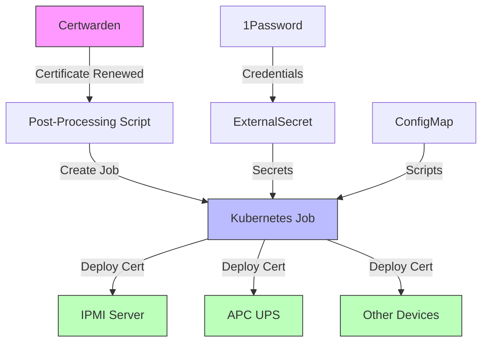
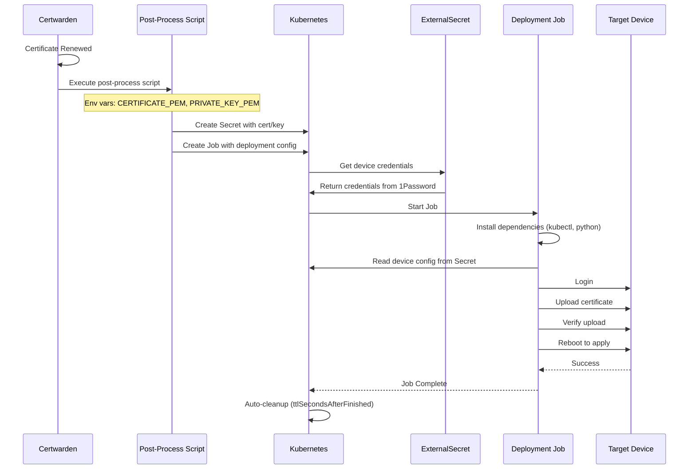
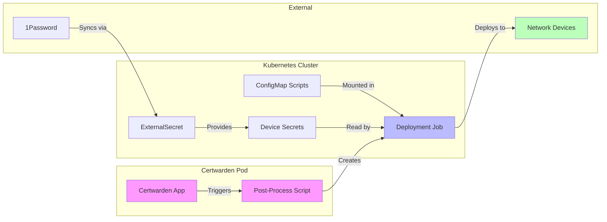
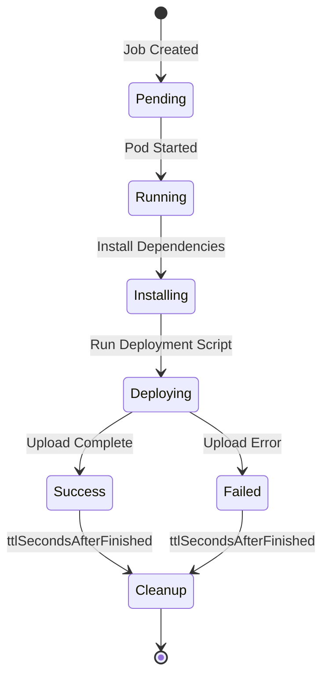

# Certwarden Certificate Deployment

Automated certificate deployment to network devices using Kubernetes Jobs triggered by Certwarden certificate renewals.

## Overview

This deployment system allows Certwarden to automatically push renewed certificates to various network devices including IPMI interfaces, APC UPS units, and more.

## Architecture



## Supported Devices

### ✅ IPMI Servers (Supermicro)
- **Status**: Production Ready
- **Models**: X9, X10, X11, X12, X13, H13 (H13 uses X12 Redfish API)
- **Documentation**: [ipmi/README.md](./ipmi/README.md)
- **Quick Start**: [ipmi/QUICKSTART.md](./ipmi/QUICKSTART.md)

### 🚧 APC UPS
- **Status**: Coming Soon
- **Models**: TBD
- **Documentation**: Coming soon

## Directory Structure

```
cert-deployment/
├── README.md                    # This file - overview and architecture
├── kustomization.yaml           # Main kustomization - includes all device types
│
├── ipmi/                        # IPMI server certificate deployment
│   ├── README.md                # Detailed IPMI documentation
│   ├── QUICKSTART.md            # Quick start guide for IPMI
│   ├── RECONCILE.md             # Flux reconciliation guide
│   ├── kustomization.yaml       # IPMI-specific kustomization
│   ├── externalsecret.yaml      # 1Password secrets for IPMI hosts
│   ├── rbac.yaml                # ServiceAccount and RBAC for jobs
│   ├── ipmi-updater.py          # Python script for IPMI cert upload
│   └── certwarden-ipmi-deploy.sh # Bash wrapper for job creation
│
└── apc/                         # APC UPS certificate deployment (coming soon)
    └── README.md                # APC documentation (TBD)
```

## How It Works

### Flow Diagram



### Component Responsibilities



## Quick Start

### 1. Choose Your Device Type

- **IPMI Servers**: See [ipmi/QUICKSTART.md](./ipmi/QUICKSTART.md)
- **APC UPS**: Coming soon

### 2. Prerequisites

- Kubernetes cluster with Flux
- Certwarden installed and configured
- 1Password with ExternalSecrets operator
- Device credentials stored in 1Password
- Network connectivity from cluster to devices

### 3. Configuration Pattern

Each device type follows this pattern:

1. **Store credentials** in 1Password
2. **Create ExternalSecret** to sync credentials
3. **Configure device info** in ConfigMap or Secret
4. **Deploy manifests** via Flux
5. **Test manually** with a Job
6. **Configure Certwarden** to trigger deployments

## Testing

Each device type includes a quick test procedure:

```bash
# Example for IPMI (see specific README for details)
cd kubernetes/apps/infrastructure/certwarden/cert-deployment/ipmi
kubectl apply -k .
# Follow device-specific testing guide
```

## Monitoring

### Check Job Status

```bash
# List recent deployment jobs
kubectl get jobs -n infrastructure -l app.kubernetes.io/part-of=certwarden

# View job logs
kubectl logs -n infrastructure job/<job-name>

# Check ExternalSecrets
kubectl get externalsecret -n infrastructure
```

### Job Lifecycle



Jobs automatically cleanup after completion:
- **Success**: Deleted after 5 minutes (300s)
- **Failure**: Deleted after 5 minutes (300s)
- Logs available during cleanup window

## Security Considerations

### ✅ Security Features

- Non-root containers (UID 1000)
- Read-only root filesystem where possible
- All capabilities dropped
- Secrets from 1Password via ExternalSecrets
- No certificate data persisted to disk
- Service account with minimal RBAC permissions
- Job-specific temporary secrets (auto-deleted)

### ⚠️ Known Limitations

- SSL verification disabled for IPMI connections (required for self-signed IPMI certs)
- Credentials stored in Kubernetes secrets (encrypted at rest)

## Troubleshooting

### Common Issues

**ExternalSecret Not Ready**
```bash
kubectl describe externalsecret -n infrastructure <name>
# Check 1Password connectivity and field names
```

**Job Failing**
```bash
kubectl logs -n infrastructure job/<job-name>
# Look for connection errors, authentication failures, or upload errors
```

**Network Connectivity**
```bash
# Test from a pod
kubectl run -it --rm debug --image=alpine -- ping <device-ip>
```

### Debug Mode

Most deployment scripts support `--debug` flag for verbose logging:
- HTTP request/response details
- Certificate parsing information
- Step-by-step execution trace

## Contributing

### Adding a New Device Type

1. Create device-specific directory (e.g., `apc/`)
2. Add deployment script with device-specific logic
3. Create kustomization with ExternalSecrets and RBAC
4. Write comprehensive README with:
   - Quick start guide
   - Supported models
   - Configuration examples
   - Troubleshooting section
5. Add mermaid diagrams for clarity
6. Update this main README

### Device Script Requirements

Each device type should include:
- ✅ Comprehensive error handling
- ✅ Debug logging support
- ✅ Credential validation
- ✅ Certificate format verification
- ✅ Connection retry logic
- ✅ Clear success/failure exit codes

## Related Documentation

- [Certwarden Official Docs](https://www.certwarden.com/docs/)
- [Certwarden Post-Processing](https://www.certwarden.com/docs/using_certificates/post_process_bin/)
- [ExternalSecrets Operator](https://external-secrets.io/)

## Support

- **IPMI Issues**: See [ipmi/README.md](./ipmi/README.md)
- **General Issues**: Check Certwarden logs and job logs
- **Feature Requests**: Open an issue

---

**Last Updated**: 2025-11-21
**Status**: IPMI Production Ready, APC In Development
