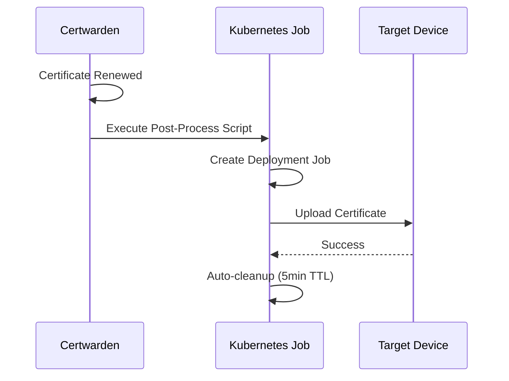

# Certwarden Certificate Deployment

Automated certificate deployment to network devices via Certwarden post-processing.

## Supported Devices

### ✅ Supermicro IPMI (X12/X13/H13)
- **Status**: Production Ready
- **API**: Redfish v1
- **Models**: X12, X13, H13 only

### 🚧 APC UPS
- **Status**: Coming Soon

## How It Works



## Directory Structure

```
cert-deployment/
├── README.md                        # This file
├── kustomization.yaml               # Includes device types
├── supermicro/                      # Supermicro IPMI deployment
│   ├── kustomization.yaml
│   ├── externalsecret.yaml
│   ├── rbac.yaml
│   ├── supermicro-updater.py
│   └── certwarden-supermicro-deploy.sh
└── apc/                             # APC deployment (future)
    └── README.md
```

## Quick Start

### Supermicro IPMI Setup

1. **Add IPMI credentials to 1Password**:
   - Item name: `{hostname}` (e.g., `cr-storage-ipmi`)
   - Fields: `IPMI_URL`, `IPMI_MODEL`, `IPMI_USERNAME`, `IPMI_PASSWORD`

2. **Update ExternalSecret** in `supermicro/externalsecret.yaml`:
   ```yaml
   dataFrom:
     - extract:
         key: {hostname}  # Your 1Password item name
   ```

3. **Deploy**:
   ```bash
   kubectl apply -k kubernetes/apps/infrastructure/certwarden/cert-deployment/
   ```

4. **Configure Certwarden** (via UI):
   - Certificate → Post-Processing
   - Script: `/app/scripts/supermicro/certwarden-supermicro-deploy.sh`
   - Environment: `SUPERMICRO_HOST={hostname}` (e.g., `cr-storage-ipmi`)

5. **Test**: Force certificate renewal in Certwarden UI

## Monitoring

```bash
# Watch for jobs
kubectl get jobs -n infrastructure -w

# View logs
kubectl logs -n infrastructure -l app.kubernetes.io/name=certwarden-supermicro-deploy -f
```

## Security

- Credentials from 1Password via ExternalSecrets
- Non-root containers
- Minimal RBAC permissions
- Auto-cleanup after 5 minutes
- SSL verification disabled (required for self-signed IPMI certs)

## Troubleshooting

**Job fails?**
```bash
kubectl logs -n infrastructure job/<job-name>
```

**ExternalSecret not syncing?**
```bash
kubectl describe externalsecret -n infrastructure supermicro-{hostname}
```

**Force ExternalSecret sync:**
```bash
kubectl annotate externalsecret -n infrastructure supermicro-{hostname} \
  force-sync=$(date +%s) --overwrite
```

---

**Last Updated**: 2025-11-21
**Status**: Supermicro IPMI Production Ready
