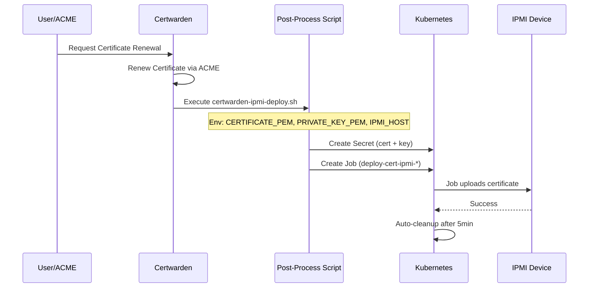

# Testing IPMI Certificate Deployment via Certwarden

This guide shows how to configure Certwarden to automatically deploy certificates to your IPMI host.

## Prerequisites

✅ IPMI credentials stored in 1Password
✅ ExternalSecret synced successfully
✅ Scripts mounted in Certwarden pod
✅ Manual Job test passed

## Architecture



## Step 1: Verify Prerequisites

```bash
# Check ExternalSecret is ready
kubectl get externalsecret -n infrastructure ipmi-cr-storage-ipmi

# Should show: STATUS=SecretSynced, READY=True

# Check secret was created
kubectl get secret -n infrastructure ipmi-cr-storage-ipmi

# Check scripts are mounted in Certwarden
kubectl exec -n infrastructure deploy/certwarden -- ls -la /app/scripts/
# Should show: certwarden-ipmi-deploy.sh and ipmi-updater.py
```

## Step 2: Configure Certwarden Certificate

### Option A: Via Certwarden UI

1. Navigate to your Certwarden UI: `https://certwarden.yourdomain.com`

2. Go to **Certificates** → Select your IPMI certificate

3. Click **Edit** → Scroll to **Post-Processing**

4. Add a new post-processing step:
   ```yaml
   Name: IPMI Deployment
   Script Path: /app/scripts/certwarden-ipmi-deploy.sh
   Environment Variables:
     IPMI_HOST: cr-storage-ipmi
     NAMESPACE: infrastructure
   ```

5. **Save** the certificate configuration

### Option B: Via Certwarden API

```bash
# Get your certificate ID
CERT_ID="<your-certificate-id>"

# Update certificate with post-processing
curl -X PATCH "https://certwarden.yourdomain.com/api/v1/certificates/${CERT_ID}" \
  -H "Authorization: Bearer ${CERTWARDEN_API_TOKEN}" \
  -H "Content-Type: application/json" \
  -d '{
    "post_processing": {
      "enabled": true,
      "script_path": "/app/scripts/certwarden-ipmi-deploy.sh",
      "environment": {
        "IPMI_HOST": "cr-storage-ipmi",
        "NAMESPACE": "infrastructure"
      }
    }
  }'
```

## Step 3: Test Certificate Renewal

### Manual Renewal Test

```bash
# Force a certificate renewal via Certwarden UI
# OR via API:
curl -X POST "https://certwarden.yourdomain.com/api/v1/certificates/${CERT_ID}/renew" \
  -H "Authorization: Bearer ${CERTWARDEN_API_TOKEN}"
```

### Monitor the Deployment

```bash
# Watch for new jobs
watch kubectl get jobs -n infrastructure -l app.kubernetes.io/name=certwarden-ipmi-deploy

# Once job appears, view logs
JOB_NAME=$(kubectl get jobs -n infrastructure -l app.kubernetes.io/name=certwarden-ipmi-deploy --sort-by=.metadata.creationTimestamp -o jsonpath='{.items[-1:].metadata.name}')
kubectl logs -n infrastructure job/$JOB_NAME -f
```

## Step 4: Verify Deployment

### Check Job Status

```bash
# Get job status
kubectl get job -n infrastructure $JOB_NAME

# Should show: COMPLETIONS=1/1, AGE=<recent>
```

### Check IPMI Certificate

```bash
# Option 1: Via Web Browser
# Navigate to https://cr-storage-ipmi.yourdomain.com
# Check certificate details - should show new expiry date

# Option 2: Via OpenSSL
echo | openssl s_client -connect cr-storage-ipmi.yourdomain.com:443 2>/dev/null | \
  openssl x509 -noout -dates
```

### Check Certwarden Logs

```bash
# View Certwarden logs for post-processing output
kubectl logs -n infrastructure deploy/certwarden --tail=100 | grep -A 20 "IPMI"
```

## Expected Log Output

### Successful Deployment

```
=== Certwarden IPMI Certificate Deployment ===
Certificate: cr-storage-ipmi.yourdomain.com
Target IPMI: cr-storage-ipmi
Namespace: infrastructure
Creating temporary secret: ipmi-cert-deploy-cr-storage-ipmi-1234567890-cert
secret/ipmi-cert-deploy-cr-storage-ipmi-1234567890-cert created
Creating deployment Job: ipmi-cert-deploy-cr-storage-ipmi-1234567890
job.batch/ipmi-cert-deploy-cr-storage-ipmi-1234567890 created
Waiting for Job to complete...
job.batch/ipmi-cert-deploy-cr-storage-ipmi-1234567890 condition met
=== Job Logs ===
DEBUG: X12 model - using Redfish login
DEBUG: Login successful, got auth token
DEBUG: Reading certificate from /certs/cert.pem
DEBUG: Certificate data length: 4021 bytes
DEBUG: Uploading to https://cr-storage-ipmi.core.codelooks.com/redfish/v1/...
SUCCESS: Certificate uploaded successfully!
✅ Certificate deployed successfully to cr-storage-ipmi
```

## Troubleshooting

### Post-Processing Script Not Executed

**Check Certwarden logs:**
```bash
kubectl logs -n infrastructure deploy/certwarden --tail=200
```

**Common causes:**
- Script path incorrect (should be `/app/scripts/certwarden-ipmi-deploy.sh`)
- Post-processing not enabled in certificate config
- Environment variables missing

### Job Creation Failed

**Check script has kubectl access:**
```bash
kubectl exec -n infrastructure deploy/certwarden -- kubectl get pods -n infrastructure
```

**Check RBAC permissions:**
```bash
kubectl auth can-i create jobs --as=system:serviceaccount:infrastructure:certwarden -n infrastructure
# Should return: yes
```

### Job Fails to Complete

**View job logs:**
```bash
kubectl logs -n infrastructure job/$JOB_NAME
```

**Common issues:**
1. **IPMI credentials wrong**: Check 1Password secret
2. **Network connectivity**: IPMI not reachable from cluster
3. **Certificate format**: Invalid PEM format
4. **IPMI model mismatch**: Verify model in secret

### Secret Not Found

```bash
# Check ExternalSecret status
kubectl describe externalsecret -n infrastructure ipmi-cr-storage-ipmi

# Manually sync if needed
kubectl annotate externalsecret -n infrastructure ipmi-cr-storage-ipmi \
  force-sync=$(date +%s) --overwrite
```

## Adding Multiple IPMI Hosts

To deploy to multiple IPMI hosts, repeat the configuration:

### 1. Create Additional Secrets in 1Password

```
Item: ipmi-server2
Fields:
  IPMI_URL: https://server2-ipmi.example.com
  IPMI_MODEL: X12
  IPMI_USERNAME: ADMIN
  IPMI_PASSWORD: password-here
```

### 2. Create Additional ExternalSecrets

```yaml
---
apiVersion: external-secrets.io/v1
kind: ExternalSecret
metadata:
  name: ipmi-server2
  namespace: infrastructure
spec:
  secretStoreRef:
    kind: ClusterSecretStore
    name: onepassword
  target:
    name: ipmi-server2
  dataFrom:
    - extract:
        key: ipmi-server2
```

### 3. Configure Certwarden Certificate

Add multiple post-processing steps OR use the same script with different `IPMI_HOST` env var:

```yaml
Environment Variables:
  IPMI_HOST: server2  # Will use secret: ipmi-server2
  NAMESPACE: infrastructure
```

## Automated Renewal Schedule

Certwarden automatically renews certificates based on your configuration:

- **Default**: 30 days before expiry
- **Configurable**: Via Certwarden settings

Once post-processing is configured, every renewal will trigger deployment automatically.

## Monitoring

### Create Alert for Failed Deployments

```yaml
# Example Prometheus alert
- alert: IPMICertDeploymentFailed
  expr: |
    kube_job_status_failed{namespace="infrastructure",job_name=~"ipmi-cert-deploy.*"} > 0
  for: 5m
  labels:
    severity: warning
  annotations:
    summary: "IPMI certificate deployment failed"
    description: "Job {{ $labels.job_name }} failed to deploy certificate"
```

### Check Deployment History

```bash
# List all IPMI deployment jobs (last 10)
kubectl get jobs -n infrastructure -l app.kubernetes.io/name=certwarden-ipmi-deploy \
  --sort-by=.metadata.creationTimestamp | tail -10

# View specific job
kubectl describe job -n infrastructure <job-name>
```

## Next Steps

✅ **Automate**: Post-processing is now configured
✅ **Monitor**: Set up alerts for failed deployments
✅ **Scale**: Add more IPMI hosts as needed
✅ **Document**: Update your runbook with IPMI hostnames

---

**Last Updated**: 2025-11-21
**Status**: Production Ready
